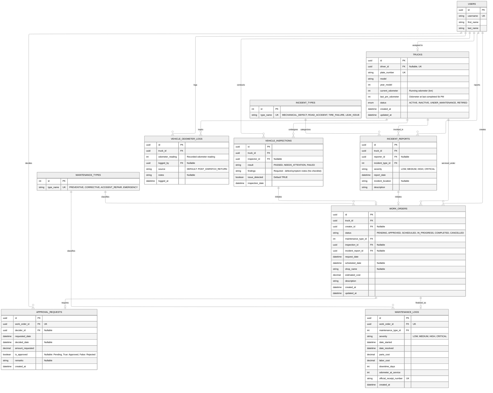

# Fleet & Maintenance Subsystem ERD

> **Domain**: Fleet & Maintenance  
> **Key Rule (No Checklist)**: Inspections are strictly issue-reporting records logged when defects or symptoms are observed. No routine checklists.  
> **PM Threshold**: `(current_odometer - last_pm_odometer) >= 5000 km` triggers scheduled preventive maintenance.

