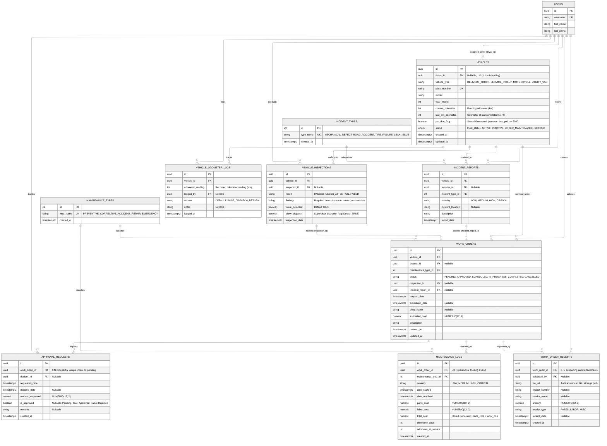

# Fleet & Maintenance Subsystem — Entity Relationship Diagram (ERD)

> **Module**: Fleet & Maintenance Subsystem  
> **Target Database**: PostgreSQL 18.x  
> **Key Architecture Decisions**:
> - **Generalized Vehicle Entities**: The legacy `trucks` table is generalized to `vehicles` (`vehicle_type`: `DELIVERY_TRUCK`, `SERVICE_PICKUP`, `MOTORCYCLE`, `UTILITY_VAN`).
> - **Driver Soft-Binding**: 1:1 soft-binding between a driver user and an assigned vehicle (`vehicles.driver_id UNIQUE REFERENCES users(id)`).
> - **Preventive Maintenance (PM) Automation**: Automated PostgreSQL stored generated column `pm_due_flag` evaluates `(current_odometer - last_pm_odometer) >= 5000` km.
> - **Issue-Reporting Inspections (No Routine Checklist)**: Inspections are captured only when defects or symptoms are observed (`allow_dispatch` preserves supervisor operational discretion).
> - **Decoupled Work Order Receipts**: Receipts serve strictly as supporting audit evidence (`0..N` per work order), decoupled from parts/labor financial mathematics.
> - **1:N Multi-Approval Workflow**: Sequential approval requests supported per work order, protected by a PostgreSQL partial unique index (`UQ_approval_requests_pending`) guaranteeing at most one active pending request.

---

## 1. Mermaid Entity-Relationship Diagram

```mermaid
---
config:
  layout: elk
  theme: neutral
---

erDiagram

    %% ==========================================
    %% DOMAIN CLASSIFICATIONS & TYPES
    %% ==========================================

    %% truck_status (PostgreSQL ENUM):
    %%   ACTIVE, INACTIVE, UNDER_MAINTENANCE, RETIRED

    %% vehicle_type (VARCHAR CHECK):
    %%   DELIVERY_TRUCK, SERVICE_PICKUP, MOTORCYCLE, UTILITY_VAN

    %% inspection_result (VARCHAR CHECK):
    %%   PASSED, NEEDS_ATTENTION, FAILED

    %% incident_severity (VARCHAR CHECK):
    %%   LOW, MEDIUM, HIGH, CRITICAL

    %% work_order_status (VARCHAR CHECK):
    %%   PENDING, APPROVED, SCHEDULED, IN_PROGRESS, COMPLETED, CANCELLED

    %% receipt_type (VARCHAR CHECK):
    %%   PARTS, LABOR, MISC


    %% ==========================================
    %% LOOKUP / CLASSIFICATION TABLES
    %% ==========================================

    MAINTENANCE_TYPES {
        int id PK
        string type_name UK "PREVENTIVE, CORRECTIVE, ACCIDENT_REPAIR, EMERGENCY"
        timestamptz created_at
    }

    INCIDENT_TYPES {
        int id PK
        string type_name UK "MECHANICAL_DEFECT, ROAD_ACCIDENT, TIRE_FAILURE, LEAK_ISSUE"
        timestamptz created_at
    }


    %% ==========================================
    %% CORE ENTITIES
    %% ==========================================

    USERS {
        uuid id PK
        string username UK
        string first_name
        string last_name
    }

    VEHICLES {
        uuid id PK
        uuid driver_id FK "Nullable, UK (1:1 soft-binding)"
        string vehicle_type "DELIVERY_TRUCK, SERVICE_PICKUP, MOTORCYCLE, UTILITY_VAN"
        string plate_number UK
        string model
        int year_model
        int current_odometer "Running odometer (km)"
        int last_pm_odometer "Odometer at last completed 5k PM"
        boolean pm_due_flag "Stored Generated: (current - last_pm) >= 5000"
        enum status "truck_status: ACTIVE, INACTIVE, UNDER_MAINTENANCE, RETIRED"
        timestamptz created_at
        timestamptz updated_at
    }

    VEHICLE_ODOMETER_LOGS {
        uuid id PK
        uuid vehicle_id FK
        int odometer_reading "Recorded odometer reading (km)"
        uuid logged_by FK "Nullable"
        string source "DEFAULT: POST_DISPATCH_RETURN"
        string notes "Nullable"
        timestamptz logged_at
    }

    VEHICLE_INSPECTIONS {
        uuid id PK
        uuid vehicle_id FK
        uuid inspector_id FK "Nullable"
        string result "PASSED, NEEDS_ATTENTION, FAILED"
        string findings "Required defect/symptom notes (No checklist)"
        boolean issue_detected "Default TRUE"
        boolean allow_dispatch "Supervisor discretion flag (Default TRUE)"
        timestamptz inspection_date
    }

    INCIDENT_REPORTS {
        uuid id PK
        uuid vehicle_id FK
        uuid reporter_id FK "Nullable"
        int incident_type_id FK
        string severity "LOW, MEDIUM, HIGH, CRITICAL"
        string incident_location "Nullable"
        string description
        timestamptz report_date
    }

    WORK_ORDERS {
        uuid id PK
        uuid vehicle_id FK
        uuid creator_id FK "Nullable"
        int maintenance_type_id FK
        string status "PENDING, APPROVED, SCHEDULED, IN_PROGRESS, COMPLETED, CANCELLED"
        uuid inspection_id FK "Nullable"
        uuid incident_report_id FK "Nullable"
        timestamptz request_date
        timestamptz scheduled_date "Nullable"
        string shop_name "Nullable"
        numeric estimated_cost "NUMERIC(12, 2)"
        string description
        timestamptz created_at
        timestamptz updated_at
    }

    APPROVAL_REQUESTS {
        uuid id PK
        uuid work_order_id FK "1:N with partial unique index on pending"
        uuid decider_id FK "Nullable"
        timestamptz requested_date
        timestamptz decided_date "Nullable"
        numeric amount_requested "NUMERIC(12, 2)"
        boolean is_approved "Nullable: Pending, True: Approved, False: Rejected"
        string remarks "Nullable"
        timestamptz created_at
    }

    MAINTENANCE_LOGS {
        uuid id PK
        uuid work_order_id FK "UK (Operational Closing Event)"
        int maintenance_type_id FK
        string severity "LOW, MEDIUM, HIGH, CRITICAL"
        timestamptz date_started
        timestamptz date_resolved
        numeric parts_cost "NUMERIC(12, 2)"
        numeric labor_cost "NUMERIC(12, 2)"
        numeric total_cost "Stored Generated: parts_cost + labor_cost"
        int downtime_days
        int odometer_at_service
        timestamptz created_at
    }

    WORK_ORDER_RECEIPTS {
        uuid id PK
        uuid work_order_id FK "0..N supporting audit attachments"
        uuid uploaded_by FK "Nullable"
        string file_url "Audit evidence URI / storage path"
        string receipt_number "Nullable"
        string vendor_name "Nullable"
        numeric amount "NUMERIC(12, 2)"
        string receipt_type "PARTS, LABOR, MISC"
        timestamptz receipt_date "Nullable"
        timestamptz created_at
    }


    %% ==========================================
    %% RELATIONSHIPS
    %% ==========================================

    %% Driver assignment
    USERS ||--o| VEHICLES : "assigned_driver (driver_id)"

    %% Classification lookups
    MAINTENANCE_TYPES ||--o{ WORK_ORDERS : "classifies"
    MAINTENANCE_TYPES ||--o{ MAINTENANCE_LOGS : "classifies"
    INCIDENT_TYPES ||--o{ INCIDENT_REPORTS : "categorizes"

    %% User telemetry & workflow attribution
    USERS ||--o{ VEHICLE_ODOMETER_LOGS : "logs"
    USERS ||--o{ VEHICLE_INSPECTIONS : "conducts"
    USERS ||--o{ INCIDENT_REPORTS : "reports"
    USERS ||--o{ WORK_ORDERS : "creates"
    USERS ||--o{ APPROVAL_REQUESTS : "decides"
    USERS ||--o{ WORK_ORDER_RECEIPTS : "uploads"

    %% Vehicle associations
    VEHICLES ||--o{ VEHICLE_ODOMETER_LOGS : "tracks"
    VEHICLES ||--o{ VEHICLE_INSPECTIONS : "undergoes"
    VEHICLES ||--o{ INCIDENT_REPORTS : "involved_in"
    VEHICLES ||--o{ WORK_ORDERS : "serviced_under"

    %% Maintenance workflows
    VEHICLE_INSPECTIONS ||--o| WORK_ORDERS : "initiates (inspection_id)"
    INCIDENT_REPORTS ||--o| WORK_ORDERS : "initiates (incident_report_id)"
    WORK_ORDERS ||--o{ APPROVAL_REQUESTS : "requires"
    WORK_ORDERS ||--o| MAINTENANCE_LOGS : "finalized_as"
    WORK_ORDERS ||--o{ WORK_ORDER_RECEIPTS : "supported_by"
```

---

## 2. Table Specifications

### `vehicles`
Stores fleet assets across all operational vehicle categories with running telemetry and automated PM tracking.

| Column | Data Type | Nullable | Default / Constraints | Description |
| :--- | :--- | :--- | :--- | :--- |
| `id` | `UUID` | No | `PRIMARY KEY DEFAULT gen_random_uuid()` | Vehicle unique identifier |
| `driver_id` | `UUID` | Yes | `UNIQUE, FK -> users(id) ON DELETE SET NULL` | 1:1 soft-bound assigned driver |
| `vehicle_type` | `VARCHAR(30)` | No | `DEFAULT 'DELIVERY_TRUCK', CHECK IN (...)` | Category: `DELIVERY_TRUCK`, `SERVICE_PICKUP`, `MOTORCYCLE`, `UTILITY_VAN` |
| `plate_number` | `VARCHAR(20)` | No | `UNIQUE` | Official LTO registration plate number |
| `model` | `VARCHAR(100)` | No | Non-empty | Vehicle make/model (e.g. `Isuzu Elf 6-Wheeler`) |
| `year_model` | `INT` | No | Numeric year | Manufacture / model year |
| `current_odometer` | `INT` | No | `DEFAULT 0, CHECK >= 0` | Running vehicle mileage (km) |
| `last_pm_odometer` | `INT` | No | `DEFAULT 0, CHECK >= 0` | Mileage reading at last completed 5k PM service |
| `pm_due_flag` | `BOOLEAN` | No | `GENERATED ALWAYS AS ((current - last_pm) >= 5000) STORED` | Automated reactive preventive maintenance flag |
| `status` | `truck_status` | No | `DEFAULT 'ACTIVE'` | Operational status: `'ACTIVE'`, `'INACTIVE'`, `'UNDER_MAINTENANCE'`, `'RETIRED'` |
| `created_at` | `TIMESTAMPTZ` | No | `DEFAULT NOW()` | Record creation timestamp |
| `updated_at` | `TIMESTAMPTZ` | No | `DEFAULT NOW()` | Managed automatically via trigger |

---

### `vehicle_odometer_logs`
Logs odometer telemetry readings captured at plant yard check-in or service maintenance.

| Column | Data Type | Nullable | Default / Constraints | Description |
| :--- | :--- | :--- | :--- | :--- |
| `id` | `UUID` | No | `PRIMARY KEY DEFAULT gen_random_uuid()` | Telemetry log identifier |
| `vehicle_id` | `UUID` | No | `FK -> vehicles(id) ON DELETE CASCADE` | Target vehicle |
| `odometer_reading` | `INT` | No | `CHECK >= 0` | New recorded mileage in km |
| `logged_by` | `UUID` | Yes | `FK -> users(id) ON DELETE SET NULL` | Supervisor who recorded the mileage |
| `source` | `VARCHAR(30)` | No | `DEFAULT 'POST_DISPATCH_RETURN'` | Source: `POST_DISPATCH_RETURN`, `MAINTENANCE_INSPECTION`, `MANUAL_ADJUSTMENT` |
| `notes` | `TEXT` | Yes | `NULL` | Optional log notes |
| `logged_at` | `TIMESTAMPTZ` | No | `DEFAULT CURRENT_TIMESTAMP` | Recording timestamp |

---

### `vehicle_inspections`
Captures defect/symptom observation reports logged by inspectors. No routine checklist rows.

| Column | Data Type | Nullable | Default / Constraints | Description |
| :--- | :--- | :--- | :--- | :--- |
| `id` | `UUID` | No | `PRIMARY KEY DEFAULT gen_random_uuid()` | Inspection record identifier |
| `vehicle_id` | `UUID` | No | `FK -> vehicles(id) ON DELETE CASCADE` | Inspected vehicle |
| `inspector_id` | `UUID` | Yes | `FK -> users(id) ON DELETE SET NULL` | Performing user |
| `result` | `VARCHAR(20)` | No | `CHECK IN ('PASSED', 'NEEDS_ATTENTION', 'FAILED')` | Inspection outcome |
| `findings` | `TEXT` | No | Non-empty | Free-form observed defect/symptom notes |
| `issue_detected` | `BOOLEAN` | No | `DEFAULT TRUE` | Whether an anomaly was detected |
| `allow_dispatch` | `BOOLEAN` | No | `DEFAULT TRUE` | Supervisor discretion override flag for advisory findings |
| `inspection_date` | `TIMESTAMPTZ` | No | `DEFAULT CURRENT_TIMESTAMP` | Date and time inspection took place |

---

### `incident_types` & `incident_reports`
Categorizes and tracks road accidents, tire bursts, gas leaks, and mechanical defects.

**`incident_types`**:
| Column | Data Type | Nullable | Default / Constraints | Description |
| :--- | :--- | :--- | :--- | :--- |
| `id` | `SERIAL` | No | `PRIMARY KEY` | Classification ID |
| `type_name` | `VARCHAR(50)` | No | `UNIQUE` | Category (e.g. `ROAD_ACCIDENT`, `TIRE_FAILURE`) |
| `created_at` | `TIMESTAMPTZ` | No | `DEFAULT NOW()` | Record creation timestamp |

**`incident_reports`**:
| Column | Data Type | Nullable | Default / Constraints | Description |
| :--- | :--- | :--- | :--- | :--- |
| `id` | `UUID` | No | `PRIMARY KEY DEFAULT gen_random_uuid()` | Incident report identifier |
| `vehicle_id` | `UUID` | No | `FK -> vehicles(id) ON DELETE CASCADE` | Involved vehicle |
| `reporter_id` | `UUID` | Yes | `FK -> users(id) ON DELETE SET NULL` | Reporting user |
| `incident_type_id` | `INT` | No | `FK -> incident_types(id) ON DELETE RESTRICT` | Incident category |
| `severity` | `VARCHAR(20)` | No | `CHECK IN ('LOW', 'MEDIUM', 'HIGH', 'CRITICAL')` | Severity classification |
| `incident_location` | `VARCHAR(255)` | Yes | `NULL` | Location description or street name |
| `description` | `TEXT` | No | Non-empty | Narrative account of the incident |
| `report_date` | `TIMESTAMPTZ` | No | `DEFAULT CURRENT_TIMESTAMP` | Incident timestamp |

---

### `maintenance_types` & `work_orders`
Tracks service maintenance orders from initiation through completion.

**`maintenance_types`**:
| Column | Data Type | Nullable | Default / Constraints | Description |
| :--- | :--- | :--- | :--- | :--- |
| `id` | `SERIAL` | No | `PRIMARY KEY` | Maintenance category ID |
| `type_name` | `VARCHAR(50)` | No | `UNIQUE` | Category: `PREVENTIVE`, `CORRECTIVE`, `ACCIDENT_REPAIR`, `EMERGENCY` |
| `created_at` | `TIMESTAMPTZ` | No | `DEFAULT NOW()` | Creation timestamp |

**`work_orders`**:
| Column | Data Type | Nullable | Default / Constraints | Description |
| :--- | :--- | :--- | :--- | :--- |
| `id` | `UUID` | No | `PRIMARY KEY DEFAULT gen_random_uuid()` | Work order unique identifier |
| `vehicle_id` | `UUID` | No | `FK -> vehicles(id) ON DELETE CASCADE` | Serviced vehicle |
| `creator_id` | `UUID` | Yes | `FK -> users(id) ON DELETE SET NULL` | Creating supervisor/user |
| `maintenance_type_id` | `INT` | No | `FK -> maintenance_types(id) ON DELETE RESTRICT` | Classification |
| `status` | `VARCHAR(20)` | No | `DEFAULT 'PENDING', CHECK IN (...)` | Status: `PENDING`, `APPROVED`, `SCHEDULED`, `IN_PROGRESS`, `COMPLETED`, `CANCELLED` |
| `inspection_id` | `UUID` | Yes | `FK -> vehicle_inspections(id) ON DELETE SET NULL` | Linked inspection triggering service |
| `incident_report_id` | `UUID` | Yes | `FK -> incident_reports(id) ON DELETE SET NULL` | Linked incident report triggering service |
| `request_date` | `TIMESTAMPTZ` | No | `DEFAULT CURRENT_TIMESTAMP` | Initial request timestamp |
| `scheduled_date` | `TIMESTAMPTZ` | Yes | `NULL` | Scheduled repair shop date |
| `shop_name` | `VARCHAR(150)` | Yes | `NULL` | External machine shop / dealership name |
| `estimated_cost` | `NUMERIC(12, 2)` | No | `DEFAULT 0.00, CHECK >= 0` | Estimated repair cost |
| `description` | `TEXT` | No | Non-empty | Work order scope / service items |
| `created_at` | `TIMESTAMPTZ` | No | `DEFAULT CURRENT_TIMESTAMP` | Creation timestamp |
| `updated_at` | `TIMESTAMPTZ` | No | `DEFAULT CURRENT_TIMESTAMP` | Managed automatically via trigger |

---

### `approval_requests`
Supports multi-round cost approvals with pending guard.

| Column | Data Type | Nullable | Default / Constraints | Description |
| :--- | :--- | :--- | :--- | :--- |
| `id` | `UUID` | No | `PRIMARY KEY DEFAULT gen_random_uuid()` | Approval request identifier |
| `work_order_id` | `UUID` | No | `FK -> work_orders(id) ON DELETE CASCADE` | Associated work order |
| `decider_id` | `UUID` | Yes | `FK -> users(id) ON DELETE SET NULL` | Manager who approved/rejected the request |
| `requested_date` | `TIMESTAMPTZ` | No | `DEFAULT CURRENT_TIMESTAMP` | Submission timestamp |
| `decided_date` | `TIMESTAMPTZ` | Yes | `NULL` | Decision timestamp |
| `amount_requested` | `NUMERIC(12, 2)` | No | `CHECK >= 0` | Proposed budget amount |
| `is_approved` | `BOOLEAN` | Yes | `NULL` | State: `NULL` (Pending), `TRUE` (Approved), `FALSE` (Rejected) |
| `remarks` | `TEXT` | Yes | `NULL` | Decision rationale or rejection feedback |
| `created_at` | `TIMESTAMPTZ` | No | `DEFAULT CURRENT_TIMESTAMP` | Creation timestamp |

**Partial Unique Index:**
- `UQ_approval_requests_pending`: `CREATE UNIQUE INDEX ... (work_order_id) WHERE is_approved IS NULL` (ensures at most one pending approval request per work order, allowing revised requests after rejection).

---

### `maintenance_logs`
Operational closing record created when a work order transitions to `COMPLETED`.

| Column | Data Type | Nullable | Default / Constraints | Description |
| :--- | :--- | :--- | :--- | :--- |
| `id` | `UUID` | No | `PRIMARY KEY DEFAULT gen_random_uuid()` | Maintenance log identifier |
| `work_order_id` | `UUID` | No | `UNIQUE, FK -> work_orders(id) ON DELETE CASCADE` | 1:1 finalized work order |
| `maintenance_type_id` | `INT` | No | `FK -> maintenance_types(id) ON DELETE RESTRICT` | Final maintenance category |
| `severity` | `VARCHAR(20)` | No | `CHECK IN ('LOW', 'MEDIUM', 'HIGH', 'CRITICAL')` | Severity classification |
| `date_started` | `TIMESTAMPTZ` | No | Timestamp | Physical repair start timestamp |
| `date_resolved` | `TIMESTAMPTZ` | No | Timestamp | Physical repair completion timestamp |
| `parts_cost` | `NUMERIC(12, 2)` | No | `DEFAULT 0.00, CHECK >= 0` | Direct parts expense |
| `labor_cost` | `NUMERIC(12, 2)` | No | `DEFAULT 0.00, CHECK >= 0` | Direct labor expense |
| `total_cost` | `NUMERIC(12, 2)` | No | `GENERATED ALWAYS AS (parts + labor) STORED` | Automated total financial cost |
| `downtime_days` | `INT` | No | `DEFAULT 0, CHECK >= 0` | Vehicle operational downtime in days |
| `odometer_at_service`| `INT` | No | `CHECK >= 0` | Odometer reading when service was rendered |
| `created_at` | `TIMESTAMPTZ` | No | `DEFAULT CURRENT_TIMESTAMP` | Record creation timestamp |

---

### `work_order_receipts`
Decoupled supporting audit attachments (0..N) for work orders.

| Column | Data Type | Nullable | Default / Constraints | Description |
| :--- | :--- | :--- | :--- | :--- |
| `id` | `UUID` | No | `PRIMARY KEY DEFAULT gen_random_uuid()` | Receipt attachment identifier |
| `work_order_id` | `UUID` | No | `FK -> work_orders(id) ON DELETE CASCADE` | Target work order |
| `uploaded_by` | `UUID` | Yes | `FK -> users(id) ON DELETE SET NULL` | User who uploaded the receipt |
| `file_url` | `TEXT` | No | Non-empty | Storage URL or file path |
| `receipt_number` | `VARCHAR(100)` | Yes | `NULL` | Official vendor invoice / OR number |
| `vendor_name` | `VARCHAR(150)` | Yes | `NULL` | Issuing vendor / supplier name |
| `amount` | `NUMERIC(12, 2)` | No | `DEFAULT 0.00, CHECK >= 0` | Receipt financial amount |
| `receipt_type` | `VARCHAR(30)` | No | `DEFAULT 'PARTS', CHECK IN ('PARTS', 'LABOR', 'MISC')` | Receipt categorization |
| `receipt_date` | `TIMESTAMPTZ` | Yes | `NULL` | Date printed on the receipt |
| `created_at` | `TIMESTAMPTZ` | No | `DEFAULT CURRENT_TIMESTAMP` | Upload timestamp |

---

## 3. Triggers & Automation

- **`trigger_update_vehicles_updated_at`**: `BEFORE UPDATE` trigger on `vehicles` executing `update_vehicles_updated_at_column()`.
- **`trigger_update_work_orders_updated_at`**: `BEFORE UPDATE` trigger on `work_orders` executing `update_work_orders_updated_at_column()`.
