# Master Database Architecture — Unified Entity Relationship Diagram (ERD)

> **Database Engine**: PostgreSQL 18.x  
> **Schema Migrations**: 001 through 011 (`database/migrations/`)  
> **Total Tables**: 29 application domain tables (+1 internal `schema_migrations`, +2 compatibility views)  
> **Purpose**: Global enterprise data model showing all 6 core subsystems and all cross-domain foreign key relationships.

---

## 1. Unified Mermaid Entity-Relationship Diagram

```mermaid
---
config:
  layout: elk
  theme: neutral
---

erDiagram

    %% ========================================================
    %% 1. USER MANAGEMENT & RBAC SUBSYSTEM (7 Tables)
    %% ========================================================

    ROLES {
        uuid id PK
        string name UK
        string description
        timestamptz created_at
    }

    PERMISSIONS {
        uuid id PK
        string name UK
        string description
    }

    ROLE_PERMISSIONS {
        uuid role_id PK,FK
        uuid permission_id PK,FK
    }

    USERS {
        uuid id PK
        string username UK
        string password_hash
        string first_name
        string last_name
        string phone
        date birthdate
        uuid role_id FK
        boolean is_active
        boolean is_blocked
        boolean must_change_password
        timestamptz created_at
    }

    USER_ROLES {
        uuid user_id PK,FK
        uuid role_id PK,FK
        boolean is_primary
        timestamptz assigned_at
    }

    SESSIONS {
        uuid id PK
        uuid user_id FK
        string token_hash
        timestamptz created_at
        timestamptz expires_at
        timestamptz revoked_at
    }

    AUDIT_LOGS {
        uuid id PK
        uuid user_id FK
        uuid target_user_id FK
        string action
        string description
        timestamptz created_at
    }


    %% ========================================================
    %% 2. SYSTEM EVENT HISTORY LOGS (1 Table)
    %% ========================================================

    HISTORY_LOGS {
        uuid id PK
        uuid user_id FK
        string user_name
        string user_role
        string action_type
        string module
        string action
        string details
        string target_id
        string target_type
        jsonb metadata
        timestamptz created_at
    }


    %% ========================================================
    %% 3. FLEET & MAINTENANCE SUBSYSTEM (10 Tables)
    %% ========================================================

    VEHICLES {
        uuid id PK
        uuid driver_id FK "UK"
        string vehicle_type
        string plate_number UK
        string model
        int year_model
        int current_odometer
        int last_pm_odometer
        boolean pm_due_flag "Stored Generated"
        enum status "truck_status"
        timestamptz created_at
        timestamptz updated_at
    }

    MAINTENANCE_TYPES {
        int id PK
        string type_name UK
        timestamptz created_at
    }

    INCIDENT_TYPES {
        int id PK
        string type_name UK
        timestamptz created_at
    }

    VEHICLE_ODOMETER_LOGS {
        uuid id PK
        uuid vehicle_id FK
        int odometer_reading
        uuid logged_by FK
        string source
        string notes
        timestamptz logged_at
    }

    VEHICLE_INSPECTIONS {
        uuid id PK
        uuid vehicle_id FK
        uuid inspector_id FK
        string result
        string findings
        boolean issue_detected
        boolean allow_dispatch
        timestamptz inspection_date
    }

    INCIDENT_REPORTS {
        uuid id PK
        uuid vehicle_id FK
        uuid reporter_id FK
        int incident_type_id FK
        string severity
        string incident_location
        string description
        timestamptz report_date
    }

    WORK_ORDERS {
        uuid id PK
        uuid vehicle_id FK
        uuid creator_id FK
        int maintenance_type_id FK
        string status
        uuid inspection_id FK
        uuid incident_report_id FK
        timestamptz request_date
        timestamptz scheduled_date
        string shop_name
        numeric estimated_cost
        string description
        timestamptz created_at
        timestamptz updated_at
    }

    APPROVAL_REQUESTS {
        uuid id PK
        uuid work_order_id FK
        uuid decider_id FK
        timestamptz requested_date
        timestamptz decided_date
        numeric amount_requested
        boolean is_approved
        string remarks
        timestamptz created_at
    }

    MAINTENANCE_LOGS {
        uuid id PK
        uuid work_order_id FK "UK"
        int maintenance_type_id FK
        string severity
        timestamptz date_started
        timestamptz date_resolved
        numeric parts_cost
        numeric labor_cost
        numeric total_cost "Stored Generated"
        int downtime_days
        int odometer_at_service
        timestamptz created_at
    }

    WORK_ORDER_RECEIPTS {
        uuid id PK
        uuid work_order_id FK
        uuid uploaded_by FK
        string file_url
        string receipt_number
        string vendor_name
        numeric amount
        string receipt_type
        timestamptz receipt_date
        timestamptz created_at
    }


    %% ========================================================
    %% 4. INVENTORY SUBSYSTEM (3 Tables)
    %% ========================================================

    PRODUCTS {
        uuid id PK
        string name UK
        string category
        enum container_type "container_type_enum"
        numeric net_weight_kg
        boolean is_active
        timestamptz created_at
        timestamptz updated_at
    }

    PLANT_INVENTORY {
        uuid id PK
        uuid product_id FK "UK"
        int quantity_filled
        int quantity_empty_good
        int quantity_defective
        timestamptz last_counted_at
        timestamptz created_at
        timestamptz updated_at
    }

    PLANT_STOCK_ADJUSTMENTS {
        uuid id PK
        uuid product_id FK
        uuid recorded_by FK
        enum adjustment_type "plant_adjustment_type"
        enum target_condition "stock_condition"
        int delta_quantity
        enum source_condition "stock_condition Nullable"
        string supplier_invoice_number "Nullable"
        string reason
        timestamptz recorded_at
        timestamptz created_at
    }


    %% ========================================================
    %% 5. SALES & CUSTOMERS SUBSYSTEM (1 Table)
    %% ========================================================

    CUSTOMERS {
        uuid id PK
        string name
        string address
        string contact_number
        enum customer_type "customer_type_enum"
        boolean is_active
        timestamptz created_at
        timestamptz updated_at
    }


    %% ========================================================
    %% 6. SCHEDULE & TRIP SUBSYSTEM (7 Tables)
    %% ========================================================

    SERVICE_ZONES {
        uuid id PK
        string code UK
        string name UK
        string description
        boolean is_active
        timestamptz created_at
        timestamptz updated_at
    }

    SCHEDULE_TEMPLATES {
        uuid id PK
        uuid truck_id FK "References vehicles(id)"
        uuid zone_id FK
        int day_of_week
        uuid default_sales_user_id FK
        boolean is_active
        timestamptz created_at
        timestamptz updated_at
    }

    TRUCK_SCHEDULES {
        uuid id PK
        date scheduled_date
        uuid truck_id FK "References vehicles(id)"
        uuid sales_user_id FK
        uuid zone_id FK
        uuid created_by FK
        enum status "schedule_status"
        string notes
        timestamptz created_at
        timestamptz updated_at
    }

    TRIPS {
        uuid id PK
        uuid schedule_id FK "Nullable, Partial UK"
        uuid truck_id FK "References vehicles(id)"
        uuid driver_id FK "Snapshot"
        uuid sales_user_id FK "Snapshot"
        uuid zone_id FK
        uuid dispatched_by FK
        uuid return_odometer_log_id FK "UK"
        string trip_number UK
        enum status "trip_status"
        timestamptz departure_time
        timestamptz return_time
        string notes
        timestamptz created_at
        timestamptz updated_at
    }

    TRIP_LOADS {
        uuid id PK
        uuid trip_id FK
        enum transfer_type "transfer_type"
        string slip_number UK
        uuid recorded_by FK
        timestamptz recorded_at
        string remarks
    }

    TRIP_LOAD_ITEMS {
        uuid id PK
        uuid load_id FK
        uuid product_id FK
        enum condition "stock_condition"
        int quantity_units
    }

    TRIP_STOCK_RECONCILIATIONS {
        uuid id PK
        uuid trip_id FK "UK"
        uuid verified_by FK
        int total_loaded_full
        int total_sold_full
        int total_returned_full
        int total_returned_empty_good
        int total_returned_defective
        int net_customer_debt_created
        int full_discrepancy
        int empty_discrepancy
        jsonb reconciliation_data
        enum status "reconciliation_status"
        string supervisor_notes
        timestamptz reconciled_at
        timestamptz created_at
        timestamptz updated_at
    }


    %% ========================================================
    %% CROSS-SUBSYSTEM RELATIONSHIPS
    %% ========================================================

    %% Users & RBAC
    ROLES ||--|{ ROLE_PERMISSIONS : "defines"
    PERMISSIONS ||--|{ ROLE_PERMISSIONS : "grants"
    ROLES ||--o{ USERS : "primary_role"
    USERS ||--|{ USER_ROLES : "holds"
    ROLES ||--o{ USER_ROLES : "membership"
    USERS ||--o{ SESSIONS : "establishes"
    USERS ||--o{ AUDIT_LOGS : "logs_admin_action"

    %% Users -> History Logs
    USERS ||--o{ HISTORY_LOGS : "acts_in"

    %% Users -> Fleet
    USERS ||--o| VEHICLES : "soft_bound_driver (driver_id)"
    USERS ||--o{ VEHICLE_ODOMETER_LOGS : "recorded_by"
    USERS ||--o{ VEHICLE_INSPECTIONS : "inspected_by"
    USERS ||--o{ INCIDENT_REPORTS : "reported_by"
    USERS ||--o{ WORK_ORDERS : "created_by"
    USERS ||--o{ APPROVAL_REQUESTS : "decided_by"
    USERS ||--o{ WORK_ORDER_RECEIPTS : "uploaded_by"

    %% Fleet Internal
    VEHICLES ||--o{ VEHICLE_ODOMETER_LOGS : "has_readings"
    VEHICLES ||--o{ VEHICLE_INSPECTIONS : "undergoes"
    VEHICLES ||--o{ INCIDENT_REPORTS : "involved_in"
    VEHICLES ||--o{ WORK_ORDERS : "serviced_by"
    MAINTENANCE_TYPES ||--o{ WORK_ORDERS : "classified_as"
    MAINTENANCE_TYPES ||--o{ MAINTENANCE_LOGS : "categorized_as"
    INCIDENT_TYPES ||--o{ INCIDENT_REPORTS : "typed_as"
    VEHICLE_INSPECTIONS ||--o| WORK_ORDERS : "triggers"
    INCIDENT_REPORTS ||--o| WORK_ORDERS : "triggers"
    WORK_ORDERS ||--o{ APPROVAL_REQUESTS : "cost_requests"
    WORK_ORDERS ||--o| MAINTENANCE_LOGS : "finalized_as"
    WORK_ORDERS ||--o{ WORK_ORDER_RECEIPTS : "receipt_evidence"

    %% Users -> Schedules & Trips
    USERS ||--o{ SCHEDULE_TEMPLATES : "default_sales_rep"
    USERS ||--o{ TRUCK_SCHEDULES : "assigned_sales_rep"
    USERS ||--o{ TRUCK_SCHEDULES : "created_schedule"
    USERS ||--o{ TRIPS : "driver_snapshot"
    USERS ||--o{ TRIPS : "sales_rep_snapshot"
    USERS ||--o{ TRIPS : "dispatched_by"
    USERS ||--o{ TRIP_LOADS : "recorded_by"
    USERS ||--o{ TRIP_STOCK_RECONCILIATIONS : "verified_by"

    %% Users -> Inventory
    USERS ||--o{ PLANT_STOCK_ADJUSTMENTS : "recorded_by"

    %% Inventory Internal
    PRODUCTS ||--|| PLANT_INVENTORY : "tracks_stock_for"
    PRODUCTS ||--o{ PLANT_STOCK_ADJUSTMENTS : "adjusts"

    %% Fleet -> Schedules & Trips
    VEHICLES ||--o{ SCHEDULE_TEMPLATES : "assigned_truck (truck_id)"
    VEHICLES ||--o{ TRUCK_SCHEDULES : "assigned_truck (truck_id)"
    VEHICLES ||--o{ TRIPS : "assigned_truck (truck_id)"
    VEHICLE_ODOMETER_LOGS ||--o| TRIPS : "return_odometer (return_odometer_log_id)"

    %% Service Zones -> Schedules & Trips
    SERVICE_ZONES ||--o{ SCHEDULE_TEMPLATES : "zoned_for"
    SERVICE_ZONES ||--o{ TRUCK_SCHEDULES : "zoned_for"
    SERVICE_ZONES ||--o{ TRIPS : "destined_for"

    %% Schedules -> Trips
    TRUCK_SCHEDULES |o--o| TRIPS : "executed_as (schedule_id)"

    %% Trips -> Inventory Movement
    TRIPS ||--o{ TRIP_LOADS : "manifests"
    TRIP_LOADS ||--|{ TRIP_LOAD_ITEMS : "items"
    PRODUCTS ||--o{ TRIP_LOAD_ITEMS : "manifest_item (product_id)"

    %% Trips -> Stock Reconciliation
    TRIPS ||--o| TRIP_STOCK_RECONCILIATIONS : "reconciled_via"
```

---

## 2. Subsystem Domain Directory

| Subsystem | Table Count | Domain Tables | Documentation File |
| :--- | :--- | :--- | :--- |
| **User Management & RBAC** | 7 | `roles`, `permissions`, `role_permissions`, `users`, `user_roles`, `sessions`, `audit_logs` | [`users_and_rbac_erd.md`](./users_and_rbac_erd.md) |
| **System Event History Logs** | 1 | `history_logs` | [`system_history_logs_erd.md`](./system_history_logs_erd.md) |
| **Fleet & Maintenance** | 10 | `vehicles`, `maintenance_types`, `incident_types`, `vehicle_odometer_logs`, `vehicle_inspections`, `incident_reports`, `work_orders`, `approval_requests`, `maintenance_logs`, `work_order_receipts` | [`fleet_and_maintenance_erd.md`](./fleet_and_maintenance_erd.md) |
| **Inventory** | 3 | `products`, `plant_inventory`, `plant_stock_adjustments` | [`inventory_erd.md`](./inventory_erd.md) |
| **Sales & Customers** | 1 | `customers` | [`sales_and_delivery_erd.md`](./sales_and_delivery_erd.md) |
| **Schedule & Trips** | 7 | `service_zones`, `schedule_templates`, `truck_schedules`, `trips`, `trip_loads`, `trip_load_items`, `trip_stock_reconciliations` | [`schedule_and_trip_erd.md`](./schedule_and_trip_erd.md) |

---

## 3. Database-Wide Constraints & Architectural Invariants

1. **Foreign Key Integrity**:
   - `RESTRICT` is applied to critical audit entities (preventing deletion of active vehicles, products, users, or zones currently referenced in schedules, trips, or work orders).
   - `CASCADE` is strictly scoped to dependent operational child items (`trip_load_items` on `trip_loads`, `trip_loads` on `trips`, `work_order_receipts` on `work_orders`, `user_roles` on `users`).
   - `SET NULL` is used for supervisory telemetry and historical attribution (`logged_by`, `dispatched_by`, `verified_by`, `uploaded_by`, `created_by`, `inspector_id`).

2. **Automated PostgreSQL Stored Generated Columns**:
   - `vehicles.pm_due_flag`: `BOOLEAN GENERATED ALWAYS AS (("current_odometer" - "last_pm_odometer") >= 5000) STORED`.
   - `maintenance_logs.total_cost`: `NUMERIC(12, 2) GENERATED ALWAYS AS ("parts_cost" + "labor_cost") STORED`.

3. **Conditional / Partial Unique Indexes**:
   - `UQ_approval_requests_pending`: `CREATE UNIQUE INDEX ... (work_order_id) WHERE is_approved IS NULL` (guarantees at most 1 pending approval request per work order, enabling revised cost submissions).
   - `UQ_trips_schedule_id`: `CREATE UNIQUE INDEX ... (schedule_id) WHERE schedule_id IS NOT NULL` (ensures 1:1 execution for scheduled runs while permitting unconstrained ad-hoc trips).

4. **Timestamp Trigger Automation**:
   - All domain tables maintaining mutable state use `BEFORE UPDATE` triggers executing `update_timestamp_column()` or dedicated trigger functions to guarantee reliable `updated_at` synchronization.
