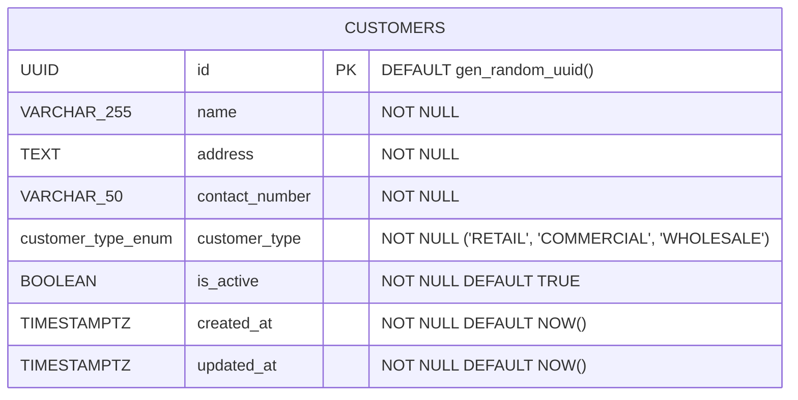

# Sales & Delivery Subsystem — Entity Relationship Diagram (ERD)

> **Module**: Sales & Delivery Subsystem  
> **Target Database**: PostgreSQL 18.x  
> **Last Updated**: August 28, 2026

---

## 1. Mermaid Entity-Relationship Diagram

---

## 2. Table Specifications

### `customers`
Stores customer profiles and business accounts for LPG distribution, orders, and delivery dispatch.

| Column | Data Type | Nullable | Default / Constraint | Description |
| :--- | :--- | :--- | :--- | :--- |
| `id` | `UUID` | No | `PRIMARY KEY DEFAULT gen_random_uuid()` | Unique customer identifier |
| `name` | `VARCHAR(255)` | No | Non-empty | Full name or business trade name of the customer |
| `address` | `TEXT` | No | Non-empty | Complete physical / delivery address |
| `contact_number` | `VARCHAR(50)` | No | Non-empty | Mobile or landline contact number |
| `customer_type` | `customer_type_enum` | No | `'RETAIL'` \| `'COMMERCIAL'` \| `'WHOLESALE'` | Customer segment category |
| `is_active` | `BOOLEAN` | No | `DEFAULT TRUE` | Soft-deactivation indicator |
| `created_at` | `TIMESTAMPTZ` | No | `DEFAULT NOW()` | Record creation timestamp |
| `updated_at` | `TIMESTAMPTZ` | No | `DEFAULT NOW()` | Record last update timestamp (managed via trigger) |

---

## 3. Triggers & Automation

- **`trigger_update_customers_updated_at`**: `BEFORE UPDATE` trigger on `customers` that executes `update_customers_updated_at_column()` to automatically maintain the `updated_at` timestamp.
