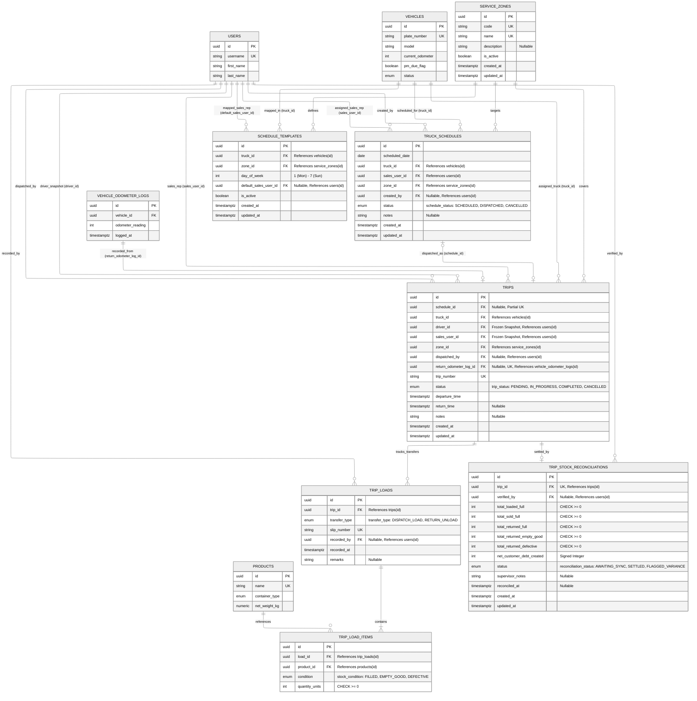

# Schedule & Trip Subsystem — Entity Relationship Diagram (ERD)

> **Module**: Schedule & Trip Subsystem  
> **Target Database**: PostgreSQL 18.x  
> **Key Architecture Decisions**:
> - **Crew Modeling & Soft-Binding**: Vehicles are generalized under `vehicles` (referenced as `truck_id REFERENCES vehicles(id)`). Drivers have a 1:1 soft-binding to physical trucks without system logins. Frontline sales representatives authenticate in the cabin mobile app.
> - **Frozen Crew Attribution**: Trips snapshot `driver_id` and `sales_user_id` at dispatch time for strict historical audit integrity.
> - **Ad-Hoc / Emergency Runs**: `trips.schedule_id` is nullable with a partial unique index (`UQ_trips_schedule_id`), allowing unscheduled dispatches.
> - **Single-Point Return Telemetry**: Trips record yard return odometer readings via `trips.return_odometer_log_id UNIQUE REFERENCES vehicle_odometer_logs(id)`.
> - **Canonical Packaging Units**: Quantities are stored strictly as integer unit counts (`quantity_units INT NOT NULL`).

---

## 1. Mermaid Entity-Relationship Diagram

---

## 2. Table Specifications

### `service_zones`
Stores geographical delivery service areas and route jurisdictions in the Davao region.

| Column | Data Type | Nullable | Default / Constraints | Description |
| :--- | :--- | :--- | :--- | :--- |
| `id` | `UUID` | No | `PRIMARY KEY DEFAULT gen_random_uuid()` | Unique service zone identifier |
| `code` | `VARCHAR(50)` | No | `UNIQUE` | Unique short alphanumeric code (e.g. `TORIL`, `CALINAN`) |
| `name` | `VARCHAR(100)` | No | `UNIQUE` | Human-readable name (e.g. `Toril District`) |
| `description` | `TEXT` | Yes | `NULL` | Route boundary and landmark details |
| `is_active` | `BOOLEAN` | No | `DEFAULT TRUE` | Soft-deactivation indicator |
| `created_at` | `TIMESTAMPTZ` | No | `DEFAULT CURRENT_TIMESTAMP` | Record creation timestamp |
| `updated_at` | `TIMESTAMPTZ` | No | `DEFAULT CURRENT_TIMESTAMP` | Managed automatically via trigger |

---

### `schedule_templates`
Stores recurring weekly master route templates per vehicle (`day_of_week` 1 to 7).

| Column | Data Type | Nullable | Default / Constraints | Description |
| :--- | :--- | :--- | :--- | :--- |
| `id` | `UUID` | No | `PRIMARY KEY DEFAULT gen_random_uuid()` | Master template identifier |
| `truck_id` | `UUID` | No | `FK -> vehicles(id) ON DELETE CASCADE` | Assigned delivery vehicle |
| `zone_id` | `UUID` | No | `FK -> service_zones(id) ON DELETE RESTRICT` | Default destination service zone |
| `day_of_week` | `INT` | No | `CHECK (day_of_week BETWEEN 1 AND 7)` | Day number: 1 = Monday, 7 = Sunday |
| `default_sales_user_id` | `UUID` | Yes | `FK -> users(id) ON DELETE SET NULL` | Default assigned frontline sales representative |
| `is_active` | `BOOLEAN` | No | `DEFAULT TRUE` | Active template indicator |
| `created_at` | `TIMESTAMPTZ` | No | `DEFAULT CURRENT_TIMESTAMP` | Record creation timestamp |
| `updated_at` | `TIMESTAMPTZ` | No | `DEFAULT CURRENT_TIMESTAMP` | Managed automatically via trigger |

**Composite Constraints & Indexes:**
- `UQ_schedule_templates_truck_day`: `UNIQUE (truck_id, day_of_week)` (prevents multiple recurring templates for one truck on the same day).

---

### `truck_schedules`
Stores concrete, date-stamped daily operational assignments generated from templates or created ad-hoc.

| Column | Data Type | Nullable | Default / Constraints | Description |
| :--- | :--- | :--- | :--- | :--- |
| `id` | `UUID` | No | `PRIMARY KEY DEFAULT gen_random_uuid()` | Operational schedule identifier |
| `scheduled_date` | `DATE` | No | Calendar date (`YYYY-MM-DD`) | Target dispatch date |
| `truck_id` | `UUID` | No | `FK -> vehicles(id) ON DELETE RESTRICT` | Assigned operational vehicle |
| `sales_user_id` | `UUID` | No | `FK -> users(id) ON DELETE RESTRICT` | Assigned frontline sales representative |
| `zone_id` | `UUID` | No | `FK -> service_zones(id) ON DELETE RESTRICT` | Target route service zone |
| `created_by` | `UUID` | Yes | `FK -> users(id) ON DELETE SET NULL` | Logistics Supervisor who generated/created the schedule |
| `status` | `schedule_status` | No | `DEFAULT 'SCHEDULED'` | Lifecycle state: `'SCHEDULED'`, `'DISPATCHED'`, `'CANCELLED'` |
| `notes` | `TEXT` | Yes | `NULL` | Dispatch instructions or special handling remarks |
| `created_at` | `TIMESTAMPTZ` | No | `DEFAULT CURRENT_TIMESTAMP` | Record creation timestamp |
| `updated_at` | `TIMESTAMPTZ` | No | `DEFAULT CURRENT_TIMESTAMP` | Managed automatically via trigger |

**Composite Constraints & Indexes:**
- `UQ_truck_schedules_truck_date`: `UNIQUE (truck_id, scheduled_date)` (prevents double-booking a truck on the same calendar day).

---

### `trips`
Tracks live trip execution, departure/return timestamps, and captures frozen crew snapshots at dispatch time.

| Column | Data Type | Nullable | Default / Constraints | Description |
| :--- | :--- | :--- | :--- | :--- |
| `id` | `UUID` | No | `PRIMARY KEY DEFAULT gen_random_uuid()` | Trip unique identifier |
| `schedule_id` | `UUID` | Yes | `FK -> truck_schedules(id) ON DELETE SET NULL` | Linked operational schedule (nullable for ad-hoc dispatches) |
| `truck_id` | `UUID` | No | `FK -> vehicles(id) ON DELETE RESTRICT` | Dispatched delivery truck |
| `driver_id` | `UUID` | No | `FK -> users(id) ON DELETE RESTRICT` | Frozen snapshot of assigned driver at dispatch time |
| `sales_user_id` | `UUID` | No | `FK -> users(id) ON DELETE RESTRICT` | Frozen snapshot of cabin sales representative at dispatch time |
| `zone_id` | `UUID` | No | `FK -> service_zones(id) ON DELETE RESTRICT` | Target delivery zone |
| `dispatched_by` | `UUID` | Yes | `FK -> users(id) ON DELETE SET NULL` | Supervisor who authorized the dispatch |
| `return_odometer_log_id` | `UUID` | Yes | `UNIQUE, FK -> vehicle_odometer_logs(id) ON DELETE SET NULL` | Telemetry link to yard return odometer reading |
| `trip_number` | `VARCHAR(50)` | No | `UNIQUE` | Human-readable sequential identifier (e.g. `TRIP-20260928-1001`) |
| `status` | `trip_status` | No | `DEFAULT 'IN_PROGRESS'` | Execution lifecycle: `'PENDING'`, `'IN_PROGRESS'`, `'COMPLETED'`, `'CANCELLED'` |
| `departure_time` | `TIMESTAMPTZ` | No | `DEFAULT CURRENT_TIMESTAMP` | Physical plant departure timestamp |
| `return_time` | `TIMESTAMPTZ` | Yes | `NULL` | Physical plant return check-in timestamp |
| `notes` | `TEXT` | Yes | `NULL` | Trip log notes or route incident remarks |
| `created_at` | `TIMESTAMPTZ` | No | `DEFAULT CURRENT_TIMESTAMP` | Record creation timestamp |
| `updated_at` | `TIMESTAMPTZ` | No | `DEFAULT CURRENT_TIMESTAMP` | Managed automatically via trigger |

**Unique Constraints & Partial Indexes:**
- `UQ_trips_schedule_id`: `CREATE UNIQUE INDEX ... WHERE schedule_id IS NOT NULL` (ensures a schedule is executed at most once, while allowing unlimited ad-hoc trips).

---

### `trip_loads`
Represents physical stock transfer manifests (morning dispatch loads, midday reloads, and post-trip return unloads).

| Column | Data Type | Nullable | Default / Constraints | Description |
| :--- | :--- | :--- | :--- | :--- |
| `id` | `UUID` | No | `PRIMARY KEY DEFAULT gen_random_uuid()` | Transfer slip unique identifier |
| `trip_id` | `UUID` | No | `FK -> trips(id) ON DELETE CASCADE` | Parent trip record |
| `transfer_type` | `transfer_type` | No | `DISPATCH_LOAD` or `RETURN_UNLOAD` | Transfer directionality |
| `slip_number` | `VARCHAR(50)` | No | `UNIQUE` | Physical transfer slip number (e.g. `SLIP-LOAD-TRIP-001`) |
| `recorded_by` | `UUID` | Yes | `FK -> users(id) ON DELETE SET NULL` | Plant/yard supervisor who recorded the count |
| `recorded_at` | `TIMESTAMPTZ` | No | `DEFAULT CURRENT_TIMESTAMP` | Timestamp when transfer was recorded |
| `remarks` | `TEXT` | Yes | `NULL` | Optional loading/unloading observations |

---

### `trip_load_items`
Stores canonical packaging line items for a stock transfer slip.

| Column | Data Type | Nullable | Default / Constraints | Description |
| :--- | :--- | :--- | :--- | :--- |
| `id` | `UUID` | No | `PRIMARY KEY DEFAULT gen_random_uuid()` | Line item identifier |
| `load_id` | `UUID` | No | `FK -> trip_loads(id) ON DELETE CASCADE` | Parent load slip |
| `product_id` | `UUID` | No | `FK -> products(id) ON DELETE RESTRICT` | Referenced catalog product |
| `condition` | `stock_condition` | No | `'FILLED'`, `'EMPTY_GOOD'`, `'DEFECTIVE'` | Physical condition of items |
| `quantity_units` | `INT` | No | `CHECK (quantity_units >= 0)` | Canonical item count (e.g. 24 canisters) |

---

### `trip_stock_reconciliations`
Tracks post-trip financial and inventory reconciliation between loaded stock, mobile app sales, customer cylinder debt, and physical yard returns.

| Column | Data Type | Nullable | Default / Constraints | Description |
| :--- | :--- | :--- | :--- | :--- |
| `id` | `UUID` | No | `PRIMARY KEY DEFAULT gen_random_uuid()` | Reconciliation record identifier |
| `trip_id` | `UUID` | No | `UNIQUE, FK -> trips(id) ON DELETE CASCADE` | 1:1 linked completed trip |
| `verified_by` | `UUID` | Yes | `FK -> users(id) ON DELETE SET NULL` | Supervisor who verified the reconciliation |
| `total_loaded_full` | `INT` | No | `DEFAULT 0, CHECK >= 0` | Aggregated full canisters/cylinders loaded |
| `total_sold_full` | `INT` | No | `DEFAULT 0, CHECK >= 0` | Aggregated full units sold from mobile app |
| `total_returned_full` | `INT` | No | `DEFAULT 0, CHECK >= 0` | Aggregated full units returned unsold |
| `total_returned_empty_good` | `INT` | No | `DEFAULT 0, CHECK >= 0` | Aggregated good empty units received back |
| `total_returned_defective` | `INT` | No | `DEFAULT 0, CHECK >= 0` | Aggregated defective empty units received back |
| `net_customer_debt_created` | `INT` | No | `DEFAULT 0` | Net customer canister debt ledger movement |
| `status` | `reconciliation_status` | No | `DEFAULT 'AWAITING_SYNC'` | Status: `'AWAITING_SYNC'`, `'SETTLED'`, `'FLAGGED_VARIANCE'` |
| `supervisor_notes` | `TEXT` | Yes | `NULL` | Variance explanations or supervisory notes |
| `reconciled_at` | `TIMESTAMPTZ` | Yes | `NULL` | Settlement verification timestamp |
| `created_at` | `TIMESTAMPTZ` | No | `DEFAULT CURRENT_TIMESTAMP` | Record creation timestamp |
| `updated_at` | `TIMESTAMPTZ` | No | `DEFAULT CURRENT_TIMESTAMP` | Managed automatically via trigger |

---

## 3. Triggers & Automation

- **`trigger_update_service_zones_updated_at`**: `BEFORE UPDATE` trigger on `service_zones` executing `update_timestamp_column()`.
- **`trigger_update_schedule_templates_updated_at`**: `BEFORE UPDATE` trigger on `schedule_templates` executing `update_timestamp_column()`.
- **`trigger_update_truck_schedules_updated_at`**: `BEFORE UPDATE` trigger on `truck_schedules` executing `update_timestamp_column()`.
- **`trigger_update_trips_updated_at`**: `BEFORE UPDATE` trigger on `trips` executing `update_timestamp_column()`.
- **`trigger_update_trip_stock_reconciliations_updated_at`**: `BEFORE UPDATE` trigger on `trip_stock_reconciliations` executing `update_timestamp_column()`.