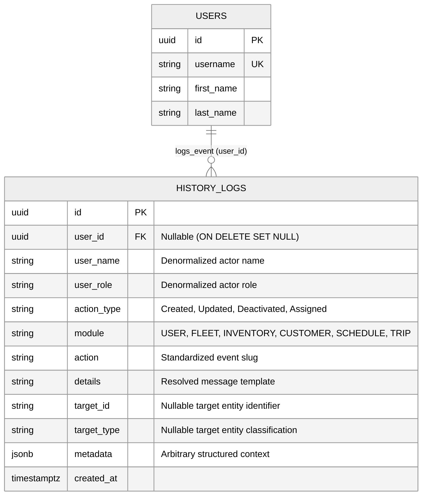

# System Event History Logs Subsystem — Entity Relationship Diagram (ERD)

> **Module**: System Event History Logs Subsystem  
> **Target Database**: PostgreSQL 18.x  
> **Key Architecture Decisions**:
> - **Centralized Event Dictionary**: All domain events originate from a unified dictionary (`src/features/history/history.events.js`) standardizing module names and action types.
> - **Denormalized Audit Snapshots**: Captures `user_name` and `user_role` directly on log entry so historical integrity remains intact even if user profiles or roles change later.
> - **Extensible JSONB Telemetry**: The `metadata` column stores arbitrary key-value context for complex event payloads.

---

## 1. Mermaid Entity-Relationship Diagram

---

## 2. Table Specifications

### `history_logs`
Chronological event ledger recording operational, financial, route, and administrative actions across the entire enterprise backend.

| Column | Data Type | Nullable | Default / Constraints | Description |
| :--- | :--- | :--- | :--- | :--- |
| `id` | `UUID` | No | `PRIMARY KEY DEFAULT gen_random_uuid()` | Unique log identifier |
| `user_id` | `UUID` | Yes | `FK -> users(id) ON DELETE SET NULL` | Performing authenticated user (system events use NULL) |
| `user_name` | `VARCHAR(150)` | No | Non-empty | Snapshot of actor's full name at log time |
| `user_role` | `VARCHAR(100)` | No | Non-empty | Snapshot of actor's active role at log time |
| `action_type` | `VARCHAR(50)` | No | Non-empty | High-level action category: `Created`, `Updated`, `Deactivated`, `Assigned` |
| `module` | `VARCHAR(100)` | No | Non-empty | Domain subsystem: `USER`, `FLEET`, `INVENTORY`, `CUSTOMER`, `SCHEDULE`, `TRIP` |
| `action` | `VARCHAR(100)` | No | Non-empty | Standard event key (e.g. `TRIP_DISPATCHED`, `PRODUCT_CREATED`) |
| `details` | `TEXT` | No | Non-empty | Resolved descriptive message |
| `target_id` | `VARCHAR(255)` | Yes | `NULL` | ID of the affected entity |
| `target_type` | `VARCHAR(100)` | Yes | `NULL` | Entity type (e.g. `TRIP`, `VEHICLE`, `PRODUCT`, `USER`) |
| `metadata` | `JSONB` | Yes | `DEFAULT '{}'::jsonb` | Structured JSON payload for auxiliary event data |
| `created_at` | `TIMESTAMPTZ` | No | `DEFAULT NOW()` | Event recording timestamp |

**Performance & Lookup Indexes:**
- `idx_history_logs_module`: B-tree index on `history_logs(module)` for module filtering.
- `idx_history_logs_action_type`: B-tree index on `history_logs(action_type)` for action category queries.
- `idx_history_logs_user_id`: B-tree index on `history_logs(user_id)` for audit tracing by actor.
- `idx_history_logs_created_at`: B-tree descending index on `history_logs(created_at DESC)` for chronological feed queries.
