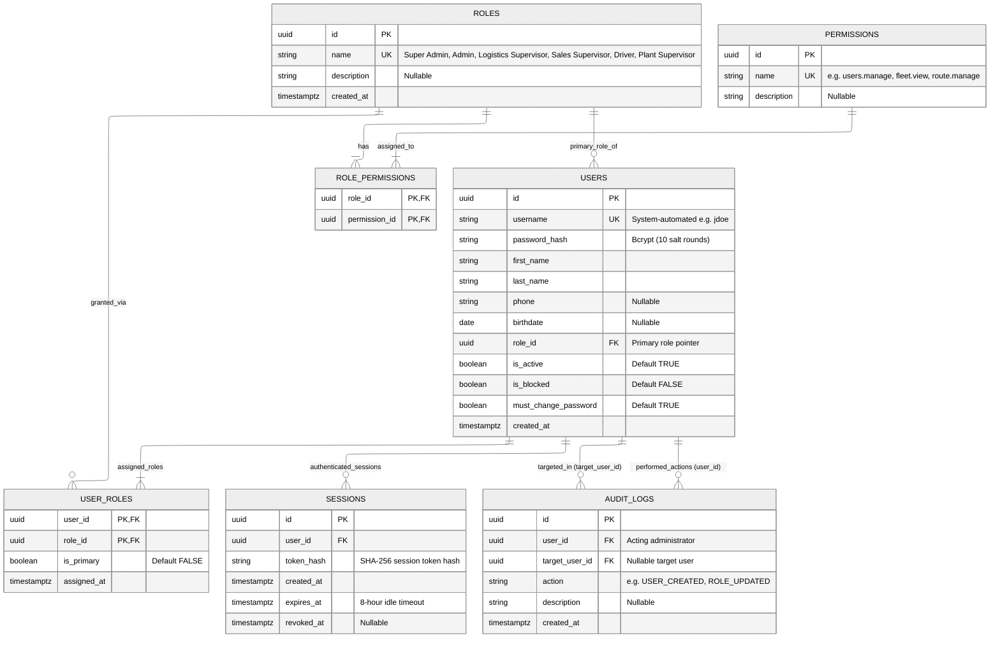

# User Management & RBAC Subsystem — Entity Relationship Diagram (ERD)

> **Module**: User Management, Authentication & RBAC Subsystem  
> **Target Database**: PostgreSQL 18.x  
> **Key Architecture Decisions**:
> - **Multi-Role Architecture**: Supported via `user_roles` junction table (`user_id`, `role_id`, `is_primary`), while preserving `users.role_id` as the primary role pointer for backward compatibility.
> - **Stateful Session Lifecycle**: Sessions stored in `sessions` table (`mg_sid` cookie maps to `token_hash`). Enforces 8-hour rolling idle timeout (`expires_at`) and 30-day absolute ceiling.
> - **Credential Security & Autonomy**: Cryptographic temporary passwords generated on creation (`must_change_password = TRUE`). Plaintext passwords never stored.
> - **Administrative Audit Trail**: High-impact administrative actions tracked in `audit_logs` (`user_id`, `target_user_id`, `action`, `description`).

---

## 1. Mermaid Entity-Relationship Diagram

---

## 2. Table Specifications

### `roles`
System-defined and organizational security roles.

| Column | Data Type | Nullable | Default / Constraints | Description |
| :--- | :--- | :--- | :--- | :--- |
| `id` | `UUID` | No | `PRIMARY KEY DEFAULT gen_random_uuid()` | Unique role identifier |
| `name` | `VARCHAR(50)` | No | `UNIQUE` | Role name (e.g. `Super Admin`, `Admin`, `Logistics Supervisor`) |
| `description` | `TEXT` | Yes | `NULL` | Role purpose and responsibility scope |
| `created_at` | `TIMESTAMPTZ` | No | `DEFAULT NOW()` | Record creation timestamp |

---

### `permissions`
Granular feature permissions protecting backend route endpoints.

| Column | Data Type | Nullable | Default / Constraints | Description |
| :--- | :--- | :--- | :--- | :--- |
| `id` | `UUID` | No | `PRIMARY KEY DEFAULT gen_random_uuid()` | Unique permission identifier |
| `name` | `VARCHAR(100)` | No | `UNIQUE` | Permission slug (e.g. `users.manage`, `fleet.view`, `route.manage`) |
| `description` | `TEXT` | Yes | `NULL` | Detailed action authority description |

---

### `role_permissions`
Many-to-many junction mapping permissions to organizational roles.

| Column | Data Type | Nullable | Default / Constraints | Description |
| :--- | :--- | :--- | :--- | :--- |
| `role_id` | `UUID` | No | `FK -> roles(id)` | Parent role |
| `permission_id` | `UUID` | No | `FK -> permissions(id)` | Granted permission |

**Composite Primary Key:** `PRIMARY KEY (role_id, permission_id)`

---

### `users`
Core user account profiles for enterprise authentication.

| Column | Data Type | Nullable | Default / Constraints | Description |
| :--- | :--- | :--- | :--- | :--- |
| `id` | `UUID` | No | `PRIMARY KEY DEFAULT gen_random_uuid()` | Unique user identifier |
| `username` | `VARCHAR(50)` | No | `UNIQUE` | System-automated username (`first_name[0] + last_name`) |
| `password_hash` | `TEXT` | No | Bcrypt hashed string | Secure password hash (10 salt rounds) |
| `first_name` | `VARCHAR(100)` | No | Non-empty | First name |
| `last_name` | `VARCHAR(100)` | No | Non-empty | Last name |
| `phone` | `VARCHAR(20)` | Yes | `NULL` | Mobile contact number |
| `birthdate` | `DATE` | Yes | `NULL` | Birthdate |
| `role_id` | `UUID` | No | `FK -> roles(id)` | Primary role foreign key |
| `is_active` | `BOOLEAN` | No | `DEFAULT TRUE` | Account active state |
| `is_blocked` | `BOOLEAN` | No | `DEFAULT FALSE` | Security block indicator |
| `must_change_password` | `BOOLEAN` | No | `DEFAULT TRUE` | First-login password change gatekeeper |
| `created_at` | `TIMESTAMPTZ` | No | `DEFAULT NOW()` | Record creation timestamp |

---

### `user_roles`
Many-to-many junction enabling employees to hold multiple organizational roles concurrently.

| Column | Data Type | Nullable | Default / Constraints | Description |
| :--- | :--- | :--- | :--- | :--- |
| `user_id` | `UUID` | No | `FK -> users(id) ON DELETE CASCADE` | Assigned user |
| `role_id` | `UUID` | No | `FK -> roles(id) ON DELETE RESTRICT` | Assigned role |
| `is_primary` | `BOOLEAN` | No | `DEFAULT FALSE` | Flags primary organizational role |
| `assigned_at` | `TIMESTAMPTZ` | No | `DEFAULT NOW()` | Assignment timestamp |

**Composite Primary Key & Indexes:**
- `PRIMARY KEY (user_id, role_id)`
- `idx_user_roles_user_id`: Index on `user_roles(user_id)` for session authorization queries.
- `idx_user_roles_role_id`: Index on `user_roles(role_id)` for role membership queries.

---

### `sessions`
Stateful user sessions for secure HTTP cookie authentication.

| Column | Data Type | Nullable | Default / Constraints | Description |
| :--- | :--- | :--- | :--- | :--- |
| `id` | `UUID` | No | `PRIMARY KEY DEFAULT gen_random_uuid()` | Session record identifier |
| `user_id` | `UUID` | No | `FK -> users(id)` | Authenticated user |
| `token_hash` | `VARCHAR(255)` | No | SHA-256 hash | Hash of the client's `mg_sid` cookie |
| `created_at` | `TIMESTAMPTZ` | No | `DEFAULT NOW()` | Login session creation timestamp |
| `expires_at` | `TIMESTAMPTZ` | No | Timestamp | Rolling 8-hour idle expiry |
| `revoked_at` | `TIMESTAMPTZ` | Yes | `NULL` | Explicit logout or password change invalidation timestamp |

---

### `audit_logs`
Tracks administrative lifecycle actions and sensitive security modifications.

| Column | Data Type | Nullable | Default / Constraints | Description |
| :--- | :--- | :--- | :--- | :--- |
| `id` | `UUID` | No | `PRIMARY KEY DEFAULT gen_random_uuid()` | Audit log identifier |
| `user_id` | `UUID` | No | `FK -> users(id)` | Administrator who performed the action |
| `target_user_id` | `UUID` | Yes | `FK -> users(id)` | Target user modified |
| `action` | `VARCHAR(100)` | No | Non-empty | Action slug (e.g. `USER_CREATED`, `USER_DEACTIVATED`, `ROLE_CHANGED`) |
| `description` | `TEXT` | Yes | `NULL` | Human-readable explanation and context |
| `created_at` | `TIMESTAMPTZ` | No | `DEFAULT NOW()` | Audit timestamp |
