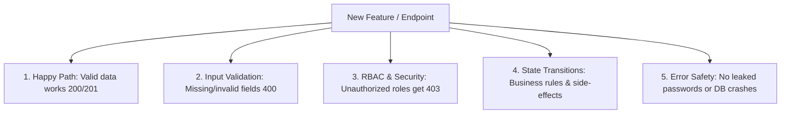

# MadayawGas: QA Testing Guide & Strategy

Welcome to the MadayawGas QA Guide! This handbook explains **your role as the QA engineer**, **how to test any feature in the system**, and **what specific test scenarios to execute**.

---

## 1. What is the QA's Role?

As the QA engineer, your mission is to be the **system defender and user advocate**:

1. **Prevent Bad Data**: Ensure the API rejects incomplete, malformed, or malicious inputs with clear error messages.
2. **Enforce Security & Permissions**: Ensure users can only see and do what their assigned role permits (RBAC).
3. **Verify Business Rules & State Transitions**: Verify that business workflows (sales, deliveries, inventory, user accounts) work smoothly and fail safely.
4. **Report Bugs Clearly**: Give developers exact reproduction steps so bugs get fixed on the first attempt.

---

## 2. General Testing Principles (For the Entire System)

Whenever a developer builds _any_ endpoint or feature (e.g., Sales, Inventory, Fleet, Users), run through these **5 General QA Checks**:



### 1. Happy Path Testing (Valid Inputs)

- Send complete, valid data.
- Verify the HTTP status code is `200 OK` or `201 Created`.
- Verify the response contains expected fields in the **JSend format** (`{ status: "success", data: { ... } }`).

### 2. Form & Input Validation (Unhappy Path)

Test what happens when the user sends bad data:

- **Missing Required Fields**: Send `{}` or omit fields (e.g., missing `price`, `username`, `quantity`). The API must return `400 Bad Request` with a helpful message, **never crash**.
- **Invalid Data Types**: Send text `"abc"` where a number is expected, or invalid date strings.
- **Boundary & Length Limits**:
  - Passwords with < 8 characters or usernames with < 3 characters.
  - Negative quantities or prices (e.g., `-10` LPG tanks).
  - Extremely long strings (e.g., 500 characters in a name field).
- **Duplicate Entries**: Attempt to register duplicate usernames, duplicate license plates, or duplicate SKU numbers. Must return `400 Bad Request`.

### 3. Role-Based Access Control (RBAC) Checks

Every endpoint has an authorized role. Always test permissions:

- **Unauthenticated Request (No Cookie)** ➔ Must return `401 Unauthorized`.
- **Wrong Role (e.g., Sales Person calling Admin route)** ➔ Must return `403 Forbidden`.
- **Correct Role (e.g., Super Admin calling Admin route)** ➔ Must return `200 OK` / `201 Created`.

### 4. State Transitions & Business Logic

Verify that state changes take effect across the system:

- When an account is **deactivated or blocked**, verify their active session is immediately revoked (`401 Unauthorized`) and they cannot log in.
- When a user changes their password, verify the old password immediately stops working.
- When inventory stock is 0, verify the system prevents creating a new sales delivery.

### 5. Security & Error Safety

- **No Sensitive Data Leaks**: Responses must **never** include `password`, `password_hash`, or internal database stack traces.
- **SQL Injection Test**: Try inputting `' OR '1'='1` in fields. The system must safely sanitize inputs and return standard error responses.

---

## 3. How to Write a High-Quality Bug Report

When you find a bug, copy and paste this standard template into your bug tracking system:

````markdown
### [BUG] Short Descriptive Title (e.g., Deactivated user can still access /me endpoint)

- **Severity**: Critical / High / Medium / Low
- **Endpoint**: `PATCH /api/users/:id/status`
- **Logged-in User Role**: Super Admin

#### Steps to Reproduce:

1. Log in as `superadmin`.
2. Deactivate `sales_user` via `PATCH /api/users/<id>/status` with body `{"isActive": false}`.
3. Switch to `sales_user`'s session and call `GET /api/users/me`.

#### Expected Result:

`GET /api/users/me` should return `401 Unauthorized` because the user was deactivated.

#### Actual Result:

`GET /api/users/me` returns `200 OK` with profile data.

#### Payload / Response Snippet:

```json
{
  "status": "success",
  "data": { ... }
}
```
````

```

```
