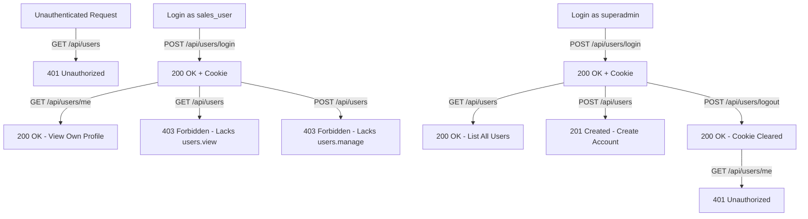

# Postman Testing Guide: Authentication & RBAC

This guide contains everything you need to test Login, Logout, Profile Management, Admin Operations, and **RBAC Permission Denials / Access Grants** in Postman or cURL.

---

## 1. Test Accounts & Credentials

The database comes pre-seeded with accounts for testing different roles and permission levels:

| Username | Password | Role | Phone | Permissions Overview |
| :--- | :--- | :--- | :--- | :--- |
| **`superadmin`** | `Superadmin123!` | **Super Admin** | `+639170000001` | **Full access**: Can manage all users, fleet, routes, sales, inventory, and deliveries. Cannot be blocked or deactivated. |
| **`admin_user`** | `AdminPass123!` | **Admin** | `+639170000002` | **Administrator access**: Can manage users, fleet, inventory, and view reports. |
| **`fleet_user`** | `FleetPass123!` | **Fleet Manager** | `+639170000003` | **Fleet & routes access**: `fleet.*`, `route.*`, `dashboard.view`. Cannot manage user accounts (`403 Forbidden`). |
| **`sales_user`** | `SalesPass123!` | **Sales Person** | `+639170000004` | **Sales representative**: `sales.view_own`, `sales.create`, `delivery.view_own`. Cannot access admin or fleet management (`403 Forbidden`). |

---

## 2. How Authentication Works in Postman

* **Stateful Session Cookie**: When you send a `POST /api/users/login`, the backend returns a `Set-Cookie: mg_sid=...` header.
* **Automatic Cookie Jar**: Postman automatically stores and attaches this `mg_sid` cookie to all subsequent requests to `http://localhost:3000`. You do not need to manually copy-paste tokens!
* **To Switch Users**: Call `POST /api/users/logout` or click **Cookies** in Postman (top right under the Send button) to clear `mg_sid`, then log in with the other account.

---

## 3. Step-by-Step Test Scenarios



---

### Scenario A: Unauthenticated Request (401 Unauthorized)

Test calling a protected endpoint before logging in.

* **Method**: `GET`
* **URL**: `http://localhost:3000/api/users`
* **Headers**: `None`

#### Expected Response (`401 Unauthorized`)
```json
{
  "status": "fail",
  "message": "Unauthorized"
}
```

---

### Scenario B: Login as `sales_user` (Normal User)

* **Method**: `POST`
* **URL**: `http://localhost:3000/api/users/login`
* **Headers**: `Content-Type: application/json`
* **Body** (raw JSON):
  ```json
  {
    "username": "sales_user",
    "password": "SalesPass123!"
  }
  ```

#### Expected Response (`200 OK`)
Sets `mg_sid` cookie.
```json
{
  "status": "success",
  "data": {
    "user": {
      "id": "ece43b18-ae50-467b-a578-66092cc92ce7",
      "username": "sales_user",
      "firstName": "Juan",
      "lastName": "Sales",
      "birthdate": null,
      "role": "Sales Person",
      "roleId": "98b3be70-2bd5-4a6d-be32-a9174cb1cb84",
      "isActive": true,
      "isBlocked": false,
      "permissions": [
        "dashboard.view",
        "route.view_own",
        "sales.view_own",
        "sales.create",
        "sales.update",
        "delivery.view_own",
        "delivery.update_own"
      ]
    }
  }
}
```

---

### Scenario C: RBAC Access Denied (`sales_user` attempts Admin operations)

While logged in as `sales_user`, attempt to access endpoints that require `users.view` or `users.manage`.

#### Test 1: List all users (`GET /api/users` - requires `users.view`)
* **Method**: `GET`
* **URL**: `http://localhost:3000/api/users`

**Expected Response (`403 Forbidden`)**:
```json
{
  "status": "fail",
  "message": "Forbidden"
}
```

#### Test 2: Create a user (`POST /api/users` - requires `users.manage`)
* **Method**: `POST`
* **URL**: `http://localhost:3000/api/users`
* **Body**:
  ```json
  {
    "username": "hacker_account",
    "password": "Password123!",
    "firstName": "Bad",
    "lastName": "Actor",
    "roleId": "98b3be70-2bd5-4a6d-be32-a9174cb1cb84"
  }
  ```

**Expected Response (`403 Forbidden`)**:
```json
{
  "status": "fail",
  "message": "Forbidden"
}
```

#### Test 3: Access Admin-only test route (`GET /api/users/admin-only-test`)
* **Method**: `GET`
* **URL**: `http://localhost:3000/api/users/admin-only-test`

**Expected Response (`403 Forbidden`)**:
```json
{
  "status": "fail",
  "message": "Forbidden"
}
```

---

### Scenario D: Allowed Operations for `sales_user`

#### Test 1: View Own Profile (`GET /api/users/me`)
* **Method**: `GET`
* **URL**: `http://localhost:3000/api/users/me`

**Expected Response (`200 OK`)**:
```json
{
  "status": "success",
  "data": {
    "user": {
      "id": "ece43b18-ae50-467b-a578-66092cc92ce7",
      "username": "sales_user",
      "firstName": "Juan",
      "lastName": "Sales",
      "role": "Sales Person",
      "permissions": [...]
    }
  }
}
```

#### Test 2: Update Own Profile (`PATCH /api/users/me`)
* **Method**: `PATCH`
* **URL**: `http://localhost:3000/api/users/me`
* **Body**:
  ```json
  {
    "firstName": "Juanito",
    "lastName": "Dela Cruz",
    "birthdate": "1994-06-15"
  }
  ```

**Expected Response (`200 OK`)**:
```json
{
  "status": "success",
  "data": {
    "user": {
      "id": "ece43b18-ae50-467b-a578-66092cc92ce7",
      "username": "sales_user",
      "firstName": "Juanito",
      "lastName": "Dela Cruz",
      "birthdate": "1994-06-15T00:00:00.000Z",
      "role": "Sales Person"
    }
  }
}
```

---

### Scenario E: Login as `superadmin` (Full Access)

* **Method**: `POST`
* **URL**: `http://localhost:3000/api/users/login`
* **Body**:
  ```json
  {
    "username": "superadmin",
    "password": "Superadmin123!"
  }
  ```

#### Test 1: List all users (`GET /api/users` - Allowed)
* **Method**: `GET`
* **URL**: `http://localhost:3000/api/users`

**Expected Response (`200 OK`)**:
```json
{
  "status": "success",
  "data": {
    "users": [
      { "username": "superadmin", "role": "Super Admin" },
      { "username": "sales_user", "role": "Sales Person" },
      { "username": "fleet_user", "role": "Fleet Manager" }
    ]
  }
}
```

#### Test 2: Admin-only route (`GET /api/users/admin-only-test` - Allowed)
* **Method**: `GET`
* **URL**: `http://localhost:3000/api/users/admin-only-test`

**Expected Response (`200 OK`)**:
```json
{
  "status": "success",
  "message": "Access granted"
}
```

#### Test 3: List System Roles (`GET /api/users/roles`)
* **Method**: `GET`
* **URL**: `http://localhost:3000/api/users/roles`

**Expected Response (`200 OK`)**:
```json
{
  "status": "success",
  "data": {
    "roles": [
      { "id": "69f0702c-...", "name": "Admin" },
      { "id": "5f60e166-...", "name": "Fleet Manager" },
      { "id": "98b3be70-...", "name": "Sales Person" },
      { "id": "d710521e-...", "name": "Super Admin" }
    ]
  }
}
```

---

### Scenario F: User Logout

* **Method**: `POST`
* **URL**: `http://localhost:3000/api/users/logout`

**Expected Response (`200 OK`)**:
```json
{
  "status": "success",
  "message": "Successfully logged out"
}
```

After logout, sending `GET /api/users/me` immediately returns:
```json
{
  "status": "fail",
  "message": "Unauthorized"
}
```
