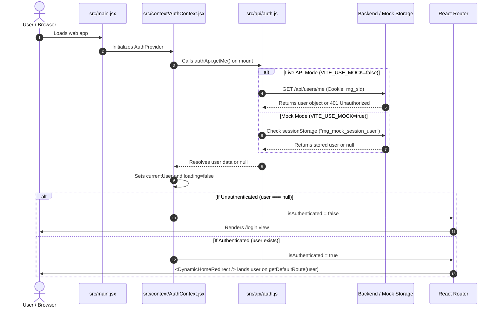
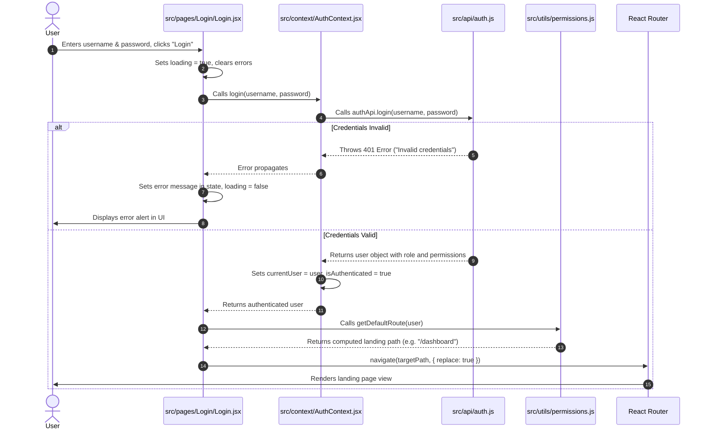
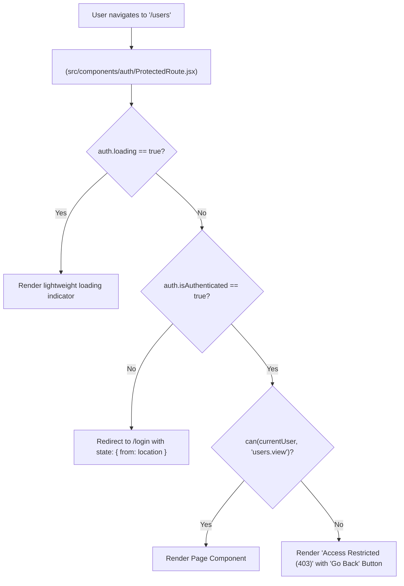
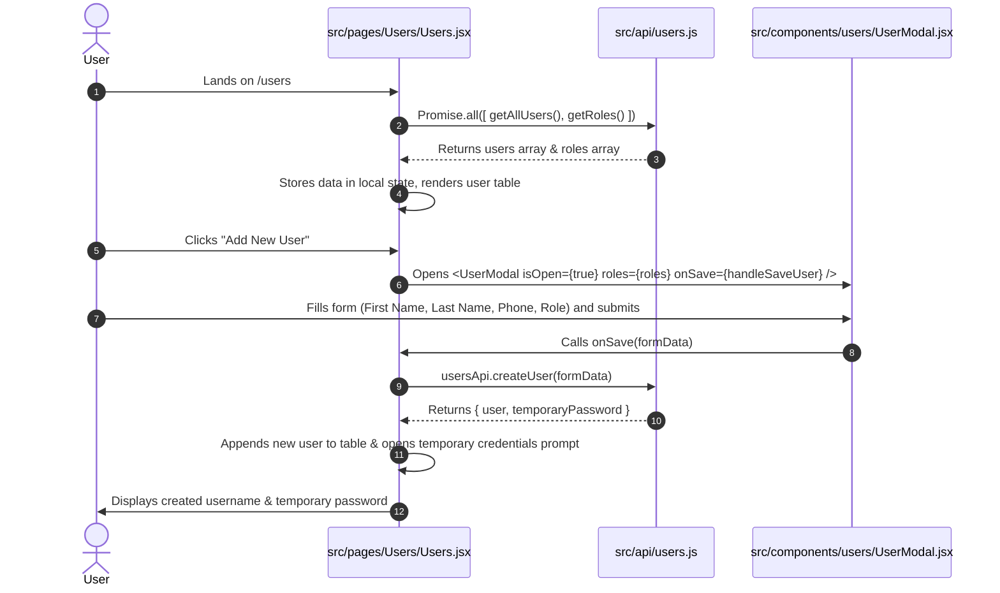
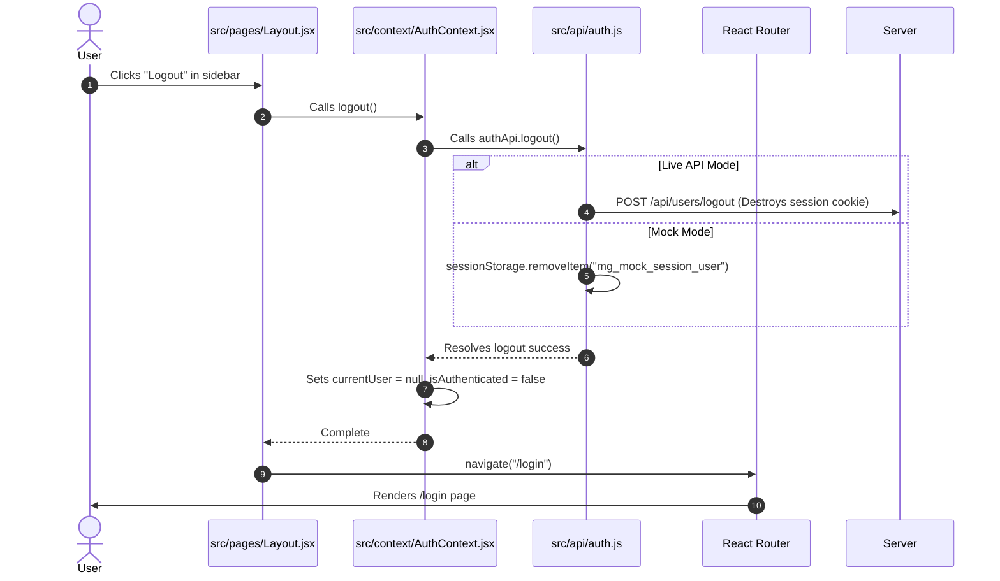

# Frontend Developer Migration & Flow Guide

## 1. Executive Summary

This dcoument provides frontend developers with a practical, file-by-file breakdown of recent architectural changes and a detailed walkthrough of the end-to-end user and data flows—from initial application boot and login to permission-driven routing and data fetching.

---

## 2. File-by-File Change Summary

### A. Deleted Files (Legacy Prototype Code)
| File Path | Rationale |
| :--- | :--- |
| `src/context/DataContext.jsx` | Monolithic context mixing auth, mock arrays, and UI state. Replaced by [`src/context/AuthContext.jsx`](../src/context/AuthContext.jsx) and [`src/api/`](../src/api/). |
| `src/data/dashboardMetrics.js` | Hardcoded mock numbers. Replaced by [`src/mocks/dashboard.json`](../src/mocks/dashboard.json) & [`src/api/dashboard.js`](../src/api/dashboard.js). |
| `src/data/salesMockData.js` | Hardcoded sales arrays. Replaced by [`src/mocks/sales.json`](../src/mocks/sales.json) & [`src/api/sales.js`](../src/api/sales.js). |
| `src/data/truckMockData.js` | Hardcoded truck fleet data. Replaced by [`src/mocks/fleet.json`](../src/mocks/fleet.json) & [`src/api/fleet.js`](../src/api/fleet.js). |
| `src/data/userMockData.js` | Hardcoded users list. Replaced by [`src/mocks/users.json`](../src/mocks/users.json) & [`src/api/users.js`](../src/api/users.js). |

---

### B. New Files Created

#### 1. Configuration & Mock Fixtures
- [**`.env.example`**](../.env.example) / [**`.env.local`**](../.env.local): Environment flags (`VITE_USE_MOCK=true/false`, `VITE_API_URL=http://localhost:5000/api`).
- [**`src/mocks/sales.json`**](../src/mocks/sales.json): Centralized sales data (`weekly`, `monthly`, `annually`).
- [**`src/mocks/fleet.json`**](../src/mocks/fleet.json): Centralized vehicle inventory and active repair records.
- [**`src/mocks/dashboard.json`**](../src/mocks/dashboard.json): Centralized overview financial and operational metrics.
- [**`src/mocks/users.json`**](../src/mocks/users.json): Centralized seed user accounts with permissions matching backend.
- [**`src/mocks/roles.json`**](../src/mocks/roles.json): System role definitions (`Super Admin`, `Admin`, `Fleet Manager`, `Sales Person`).
- [**`src/mocks/me.json`**](../src/mocks/me.json): Default active profile schema.

#### 2. API Service Layer (`src/api/`)
- [**`src/api/client.js`**](../src/api/client.js): Native `fetch` client wrapper with `credentials: 'include'`, mock delay helper, and JSON error extraction.
- [**`src/api/auth.js`**](../src/api/auth.js): `login`, `getMe`, `logout`, and `changePassword`.
- [**`src/api/users.js`**](../src/api/users.js): `getAllUsers`, `getUserById`, `getRoles`, `createUser`, `updateUser`, `updateMe`, `resetUserCredentials`, `updateUserStatus`.
- [**`src/api/fleet.js`**](../src/api/fleet.js): `getTrucks`, `getTruckById`, `createTruck`, `updateTruck`, `deleteTruck`.
- [**`src/api/sales.js`**](../src/api/sales.js): `getSalesOverview`.
- [**`src/api/dashboard.js`**](../src/api/dashboard.js): `getMetrics`.
- [**`src/api/inventory.js`**](../src/api/inventory.js): Future-ready inventory service stub.
- [**`src/api/index.js`**](../src/api/index.js): Clean barrel export.

#### 3. Route Security & RBAC Utilities
- [**`src/utils/permissions.js`**](../src/utils/permissions.js): Granular `PERMISSIONS` constants dictionary, `can()`, `canAll()`, `canAny()`, and dynamic landing resolver `getDefaultRoute(user)`.
- [**`src/context/AuthContext.jsx`**](../src/context/AuthContext.jsx): `AuthProvider` and `useAuth()` hook.
- [**`src/components/auth/ProtectedRoute.jsx`**](../src/components/auth/ProtectedRoute.jsx): Route guard evaluating authentication and required permissions.
- [**`src/components/auth/DynamicHomeRedirect.jsx`**](../src/components/auth/DynamicHomeRedirect.jsx): Dynamic root `/` redirect based on `getDefaultRoute(currentUser)`.

---

### C. Modified Files

#### 1. Router & Shell Entry Points
- [**`src/main.jsx`**](../src/main.jsx): Wrapped all child routes in `<ProtectedRoute permission={...}>` and replaced hardcoded dashboard redirect with `<DynamicHomeRedirect />`.
- [**`src/App.jsx`**](../src/App.jsx): Wrapped root tree with `<AuthProvider>`.

#### 2. Pages
- [**`src/pages/Layout.jsx`**](../src/pages/Layout.jsx): Replaced `useData()` with `useAuth()`. Uses `can(PERMISSIONS.XYZ)` to conditionally display navigation links.
- [**`src/pages/Login/Login.jsx`**](../src/pages/Login/Login.jsx): Removed all role string checks (`DRIVER`, `Sales Person`). Now calls `navigate(getDefaultRoute(user))`. Auto-redirects already-authenticated users.
- [**`src/pages/Dashboard/Dashboard.jsx`**](../src/pages/Dashboard/Dashboard.jsx): Loads metrics via `dashboardApi.getMetrics()` and sales via `salesApi.getSalesOverview()`.
- [**`src/pages/Fleet/Fleet.jsx`**](../src/pages/Fleet/Fleet.jsx): Loads vehicles via `fleetApi.getTrucks()` and drivers via `usersApi.getAllUsers()`.
- [**`src/pages/Users/Users.jsx`**](../src/pages/Users/Users.jsx): Loads users and roles via `usersApi`, delegates mutations to `usersApi`, and renders generated temporary password modal on account creation.

#### 3. Components
- [**`src/components/dashboard/SalesGraph.jsx`**](../src/components/dashboard/SalesGraph.jsx): Now pure props-driven; accepts `salesData` prop from `Dashboard.jsx`.
- [**`src/components/fleet/TruckModal.jsx`**](../src/components/fleet/TruckModal.jsx): Now pure props-driven; accepts `trucks` and `driverOptions` from `Fleet.jsx`.
- [**`src/components/users/UserModal.jsx`**](../src/components/users/UserModal.jsx): Now pure props-driven; accepts `roles` and `onSave` from `Users.jsx`.
- [**`src/components/users/PermissionsModal.jsx`**](../src/components/users/PermissionsModal.jsx): Uses system `PERMISSIONS` constants from `permissions.js`.
- [**`src/components/ui/Modal.jsx`**](../src/components/ui/Modal.jsx): Fixed animation state synchronization and attached `onClose` to backdrop click.

---

## 3. End-to-End Application Flows

### Flow 1: App Initialization & Session Verification (Page Refresh or First Load)

When a user opens the application (e.g. `http://localhost:5173/`):



---

### Flow 2: User Login Flow



---

### Flow 3: Protected Route & RBAC Permission Checking

When a user navigates to a protected route (either via sidebar link or typing directly in URL):



---

### Flow 4: Page Mount & API Data Flow (Example: `Users.jsx`)



---

### Flow 5: Logout Flow



---

## 4. Frontend Developer Cheat Sheet & Recipes

### Recipe 1: How to Check Permissions in a Component or Page
```jsx
import { useAuth } from "../context/AuthContext.jsx";
import { PERMISSIONS } from "../utils/permissions.js";

export default function ActionButtons() {
  const { can, canAll, canAny } = useAuth();

  return (
    <div className="flex gap-2">
      {/* Single permission check */}
      {can(PERMISSIONS.FLEET_MANAGE) && (
        <button className="btn-primary">Edit Vehicle</button>
      )}

      {/* Multiple permissions check (OR) */}
      {canAny([PERMISSIONS.SALES_VIEW, PERMISSIONS.SALES_VIEW_OWN]) && (
        <button className="btn-secondary">View Sales Report</button>
      )}

      {/* Multiple permissions check (AND) */}
      {canAll([PERMISSIONS.USERS_VIEW, PERMISSIONS.USERS_MANAGE]) && (
        <button className="btn-danger">Delete User</button>
      )}
    </div>
  );
}
```

---

### Recipe 2: How to Add a New Protected Route in `src/main.jsx`
```jsx
import ProtectedRoute from "./components/auth/ProtectedRoute.jsx";
import { PERMISSIONS } from "./utils/permissions.js";
import NewFeaturePage from "./pages/NewFeature/NewFeaturePage.jsx";

// Inside createBrowserRouter children:
{
  path: "new-feature",
  element: (
    <ProtectedRoute permission={PERMISSIONS.INVENTORY_VIEW}>
      <NewFeaturePage />
    </ProtectedRoute>
  ),
}
```

---

### Recipe 3: How to Create a New API Service in `src/api/`
```javascript
// src/api/reports.js
import { apiClient, isMock, delay } from "./client.js";
import mockReports from "../mocks/reports.json" with { type: "json" };

export const reportsApi = {
  async getReports() {
    if (isMock) {
      await delay(200);
      return mockReports.data.reports;
    }
    const result = await apiClient("/reports");
    return result.data.reports;
  },

  async generateReport(payload) {
    if (isMock) {
      await delay(300);
      return { id: `rep-${Date.now()}`, ...payload };
    }
    const result = await apiClient("/reports", {
      method: "POST",
      body: payload,
    });
    return result.data.report;
  },
};
```

---

### Recipe 4: How to Create a Pure Props-Driven Component
```jsx
// src/components/reports/ReportModal.jsx
import { useState } from "react";
import Modal from "../ui/Modal.jsx";
import Button from "../ui/Button.jsx";

export default function ReportModal({ isOpen, onClose, onGenerate }) {
  const [reportType, setReportType] = useState("monthly");

  const handleSubmit = (e) => {
    e.preventDefault();
    onGenerate({ type: reportType });
    onClose();
  };

  return (
    <Modal isOpen={isOpen} onClose={onClose} title="Generate Report">
      <form onSubmit={handleSubmit} className="space-y-4">
        {/* Form controls */}
        <div className="flex justify-end gap-2">
          <Button variant="secondary" onClick={onClose}>Cancel</Button>
          <Button variant="primary" type="submit">Generate</Button>
        </div>
      </form>
    </Modal>
  );
}
```

---

## 5. Seed Accounts Quick Reference

| Username | Password | Role | Permissions Count | Primary Access |
| :--- | :--- | :--- | :--- | :--- |
| `superadmin` | `Superadmin123!` | Super Admin | 19 (All) | Full System Access |
| `admin_user` | `AdminPass123!` | Admin | 15 | Dashboard, Fleet, Route, Inventory, Sales, Users |
| `fleet_user` | `FleetPass123!` | Fleet Manager | 8 | Dashboard, Fleet, Route, Inventory |
| `sales_user` | `SalesPass123!` | Sales Person | 7 | Dashboard, Own Routes, Own Sales, Sales Creation |
