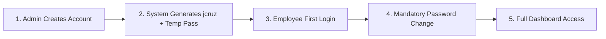
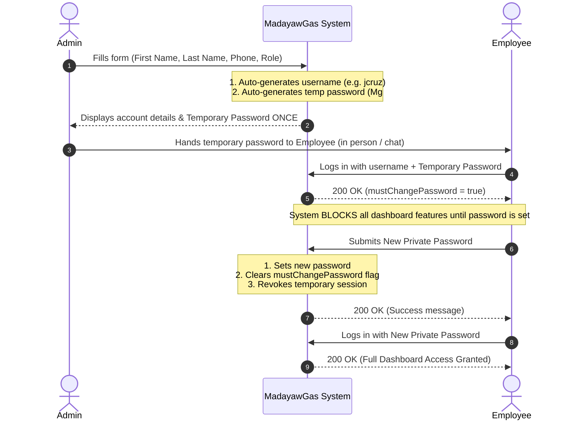
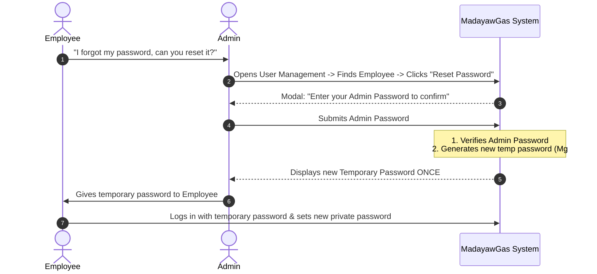

# MadayawGas: User Management & Authentication

## 1. Executive Summary: What Changed & What's New

1. **Automatic Username Generation**:
   * Admins no longer create or type usernames.
   * The system automatically generates the username using the formula: **first letter of First Name + Last Name** (e.g., `Juan Cruz` ➔ `jcruz`).
   * If `jcruz` is already taken, the system automatically handles the collision (e.g., `jcruz1`, `jcruz2`).

2. **Automatic Temporary Password Generation**:
   * Admins no longer create or type user passwords.
   * The system automatically creates a secure, random temporary password (e.g., `Mg#8xK9pL2!`) and shows it to the Admin **only once** upon account creation.
   * Plain text passwords are **never stored in the database** and can never be retrieved by anyone.

3. **Contact Phone Number Field (`phone`)**:
   * User profiles now include an optional contact phone number (e.g. `+639171234567`) for direct contact with drivers and sales staff.

4. **Mandatory First-Login Password Change**:
   * When an employee logs in for the first time with their temporary password, the system forces them to create their own private password before they can access any feature (Sales, Fleet, Routes, Inventory).
   * **Zero Redundancy**: On first login, the user only has to type their **new** password. They do not need to re-type the complicated temporary password.

5. **Admin Password Confirmation on Dangerous Actions**:
   * To prevent accidental mistakes or unauthorized actions on an unattended laptop, an Admin must enter their **own secret password** to confirm:
     * Deactivating or activating an account.
     * Blocking or unblocking an account.
     * Resetting another user's password.

6. **Stateful Server Sessions**:
   * No complex token management in frontend storage. Sessions are securely held in HTTP-Only cookies (`mg_sid`).
   * **8-Hour Idle Timeout**: Sessions expire if inactive for 8 hours.
   * **30-Day Absolute Lifetime**: Sessions hard-expire after 30 days regardless of activity.

---

## 2. Core User Flows & Step-by-Step Workflows

---

### Flow 1: Employee Onboarding (Account Creation to First Login)

#### What QA Should Test:
- [ ] Admin submits without providing a username or password ➔ Account is created successfully.
- [ ] System returns username in `first_name[0] + last_name` format.
- [ ] Employee logs in with temporary password ➔ Can ONLY access the change-password screen; calling other APIs (Fleet, Sales, Inventory) returns `403 Forbidden`.
- [ ] Employee sets new password with only `newPassword` (no `currentPassword` required).
- [ ] Employee can log in with new password and access dashboard.

---

### Flow 2: Daily Employee Login & Session Expiration

1. Employee enters username and private password.
2. System sets an encrypted, secure cookie (`mg_sid`).
3. **Active Use**: Every time the employee clicks around or makes requests, the 8-hour idle timer refreshes.
4. **Inactivity**: If the employee leaves their computer idle for 8+ hours, the session expires and redirects to login.
5. **Logout**: Clicking "Log Out" immediately destroys the session in the database and clears the cookie.

---

### Flow 3: Voluntary Password Change (From Profile)

When an established employee wants to update their password from their profile:

1. Employee goes to **Profile / Settings -> Change Password**.
2. Employee enters **Current Password** and **New Password** (minimum 8 characters).
3. System verifies the current password, updates to the new password, and invalidates all active sessions for safety.
4. Employee logs in again with the new password.

---

### Flow 4: Forgot Password / Admin Password Reset

Because truck drivers and yard staff do not have company email inboxes and SMS is costly, password resets are **Admin-Assisted**:

---

### Flow 5: Deactivating or Blocking an Employee

When an employee leaves the company or is suspended:

1. Admin goes to **User Management** -> selects employee -> toggles **Deactivate** or **Block**.
2. System prompts Admin to enter their **Admin Password** to confirm.
3. Upon confirmation:
   * The user is marked inactive or blocked in PostgreSQL.
   * **Instant Lockout**: All of that employee's active sessions across all devices are immediately revoked.
   * Future login attempts return `401 Invalid credentials`.
4. **Super Admin Safety Rule**: The system strictly prevents deactivating or blocking the Super Admin account.

---

## 3. System Roles & Permissions Matrix

The MadayawGas system uses **Role-Based Access Control (RBAC)**. Here is what each role is permitted to do:

| Feature / Action | Super Admin | Admin | Fleet Manager | Sales Person |
| :--- | :---: | :---: | :---: | :---: |
| **View Dashboard** | ✅ | ✅ | ✅ | ✅ |
| **Manage Users (Create, Reset, Deactivate)** | ✅ | ✅ | ❌ | ❌ |
| **View All Users List** | ✅ | ✅ | ❌ | ❌ |
| **Manage Fleet Vehicles & Maintenance** | ✅ | ✅ | ✅ | ❌ |
| **View Fleet & Route Operations** | ✅ | ✅ | ✅ | ❌ |
| **View Own Assigned Route** | ✅ | ✅ | ✅ | ✅ |
| **Manage Inventory & Stock** | ✅ | ✅ | ❌ | ❌ |
| **Create & Update Sales** | ✅ | ✅ | ❌ | ✅ |
| **View All Sales Records** | ✅ | ✅ | ❌ | ❌ (Own only) |
| **Update Deliveries** | ✅ | ✅ | ✅ | ❌ (Own only) |

---

## 4. Pre-Configured Test Accounts (Seed Credentials)

The database includes permanent test accounts ready for Postman and QA testing (`must_change_password = FALSE`):

| Username | Password | Role | Phone | Notes |
| :--- | :--- | :--- | :--- | :--- |
| **`superadmin`** | `Superadmin123!` | **Super Admin** | `+639170000001` | Full permissions. Cannot be deactivated. |
| **`admin_user`** | `AdminPass123!` | **Admin** | `+639170000002` | Admin access for users, fleet, inventory. |
| **`fleet_user`** | `FleetPass123!` | **Fleet Manager** | `+639170000003` | Fleet management. Cannot manage users. |
| **`sales_user`** | `SalesPass123!` | **Sales Person** | `+639170000004` | Sales rep. Own sales/deliveries only. |

---

## 5. QA Quick Test Checklist

When testing user management in Postman or on the web app:

1. **Happy Path User Creation**:
   - [ ] Admin creates user with `{ firstName: "Maria", lastName: "Santos", phone: "+639170001122", roleId: "<role_uuid>" }`.
   - [ ] Verify returned username is `msantos`.
   - [ ] Verify returned `temporaryPassword` starts with `Mg#`.
2. **Duplicate Name / Collision Handling**:
   - [ ] Admin creates another user with `{ firstName: "Mark", lastName: "Santos", ... }`.
   - [ ] Verify returned username is `msantos1`.
3. **First Login & Gatekeeper**:
   - [ ] Log in as `msantos` with temporary password.
   - [ ] Attempt calling `/api/users/roles` or other business endpoints ➔ Expect `403 Forbidden` (`MUST_CHANGE_PASSWORD`).
   - [ ] Call `/api/users/change-password` with only `{ "newPassword": "MySecretPass123!" }` ➔ Expect `200 OK`.
   - [ ] Log in with new password ➔ Expect full access.
4. **Dangerous Action Password Confirmation**:
   - [ ] Try deactivating an account without `adminPassword` ➔ Expect `401 Unauthorized`.
   - [ ] Try deactivating with wrong `adminPassword` ➔ Expect `401 Unauthorized`.
   - [ ] Provide correct `adminPassword` ➔ Expect `200 OK` and target user's active session is revoked immediately.
