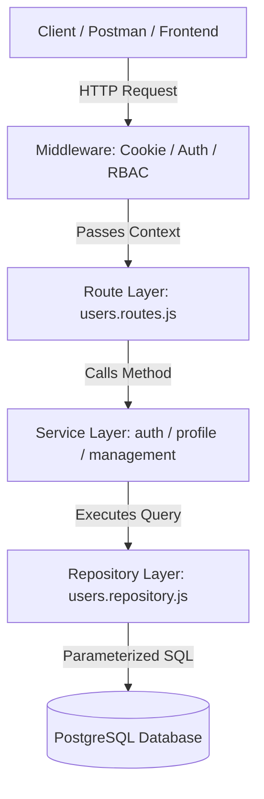

# MadayawGas Backend: Developer Guide & Architecture Conventions

Welcome to the MadayawGas backend! This guide explains the project structure, architectural patterns, coding conventions, authentication flow, and testing practices.

---

## 1. Architectural Overview

This project is built with **Node.js**, **Express**, and **PostgreSQL**. It follows two standard architectural patterns:

1. **Feature-Based Folder Structure** (also known as *Package by Feature* or *Vertical Slice*): Code is grouped by business domain (e.g. `users`, `fleet`, `sales`) rather than generic technical folders.
2. **3-Layer Architecture** (Inside each feature):
   - **Route Layer (`*.routes.js`)**: Handles HTTP requests, input parsing, middleware, and responses.
   - **Service Layer (`*.service.js`)**: Handles business logic, domain rules, data transformation, and security checks.
   - **Repository Layer (`*.repository.js`)**: Handles raw database communication using SQL queries.



---

## 2. Directory Structure

```text
madayawgas-backend/
├── database/
│   ├── connection.js             # PostgreSQL pg.Pool client & query helper
│   ├── migrations/               # Versioned DDL SQL scripts (001_initial-setup.sql)
│   └── seeds/                    # Seed data (user_management_seed.sql)
├── docs/                         # API contract & developer documentation
├── src/
│   ├── config/                   # Environment variables & constants
│   ├── features/                 # Domain features (Package by Feature)
│   │   └── users/
│   │       ├── auth.service.js       # Login, logout, session lifecycle, password change
│   │       ├── profile.service.js    # User profile viewing & personal updates
│   │       ├── management.service.js # User creation, credential reset, deactivation/blocking, roles
│   │       ├── permission.service.js # RBAC permission evaluation helpers (can, isScopedToOwn)
│   │       ├── users.repository.js   # Parameterized SQL database queries
│   │       ├── users.routes.js       # Express HTTP route handlers
│   │       └── users.service.js      # Facade combining domain services
│   ├── middleware/
│   │   ├── auth.middleware.js        # authenticate & requirePermission route guards
│   │   ├── cookie.middleware.js      # Zero-dependency HTTP-Only cookie parser
│   │   └── error.middleware.js       # Centralized global error handler
│   ├── utils/
│   │   └── asyncHandler.js           # Wraps async route handlers to catch uncaught errors
│   ├── app.js                    # Express app configuration & middleware pipeline
│   ├── server.js                 # Server entry point (starts HTTP server on port 3000)
│   └── test/                     # Modular domain test suites (node:test)
│       ├── auth.test.js
│       ├── permission.test.js
│       ├── profile.test.js
│       └── management.test.js
```

---

## 3. Layer Responsibilities & Strict Rules

### Layer 1: Route Layer (`*.routes.js`)
* **Purpose**: Maps HTTP endpoints to service methods.
* **Rules**:
  * Always wrap async route handlers with `asyncHandler(...)` to avoid unhandled promise rejections.
  * Use `authenticate` to protect endpoints that require login.
  * Use `requirePermission('domain.action')` to enforce RBAC.
  * **DO NOT** write SQL queries or business logic here. Delegate directly to the service layer.
  * Define static routes (e.g. `/me`, `/roles`, `/login`) **before** dynamic parameter routes (e.g. `/:id`).

```javascript
// Example: src/features/users/users.routes.js
router.get(
  '/',
  authenticate,
  requirePermission('users.view'),
  asyncHandler(async (req, res) => {
    const users = await managementService.getAllUsers();
    return res.status(200).json({
      status: 'success',
      data: { users },
    });
  })
);
```

### Layer 2: Service Layer (`*.service.js`)
* **Purpose**: Encapsulates business rules, validations, and security workflows.
* **Rules**:
  * **Never import or use Express `req` or `res` objects** in services.
  * Services should receive plain JavaScript values or plain objects and return plain objects.
  * Throw descriptive errors on validation failures (e.g. `throw new Error('Invalid credentials')`).

```javascript
// Example: src/features/users/management.service.js
async function createUser(actorUser, { firstName, lastName, phone, birthdate, roleId }) {
  const baseUsername = generateBaseUsername(firstName, lastName);
  const existingUsernames = await usersRepository.findUsernamesLike(`${baseUsername}%`);
  const finalUsername = resolveUniqueUsername(baseUsername, existingUsernames);

  const temporaryPassword = generateTemporaryPassword();
  const passwordHash = await bcrypt.hash(temporaryPassword, 10);

  const createdUser = await usersRepository.createUser({
    username: finalUsername,
    passwordHash,
    firstName,
    lastName,
    phone,
    birthdate,
    roleId,
    mustChangePassword: true,
  });

  return { user: createdUser, temporaryPassword };
}

```

### Layer 3: Repository Layer (`*.repository.js`)
* **Purpose**: Pure data access layer (CRUD) with PostgreSQL.
* **Rules**:
  * **Always use Parameterized Queries** (`$1`, `$2`, `$3`) to prevent **SQL Injection**. Never concatenate raw user input into SQL strings.
  * Return plain row objects (e.g. `result.rows[0]` or `result.rows`).

```javascript
// Example: src/features/users/users.repository.js
async function findUserByUsername(username) {
  const result = await query(
    `SELECT u.*, r.name AS role_name
     FROM users u
     JOIN roles r ON u.role_id = r.id
     WHERE u.username = $1`,
    [username]
  );
  return result.rows[0] || null;
}
```

---

## 4. Authentication & Stateful Sessions

The backend uses **Stateful Server-Side Sessions** stored in PostgreSQL with **HTTP-Only Cookies** (`mg_sid`), rather than stateless JWTs.

### Why Stateful Sessions?
Stateful sessions allow immediate server-side revocation: when an admin deactivates a user, blocks an account, changes a user's role, or resets credentials, the backend invalidates all active sessions in PostgreSQL (`revoked_at = NOW()`), immediately logging that user out.

### Session Lifecycle Rules:
1. **8-Hour Idle Timeout**: If a user is inactive for 8 hours, the session expires. Every valid authenticated request refreshes this idle timeout.
2. **30-Day Absolute Lifetime**: Regardless of activity, a session hard-expires 30 days after creation.
3. **Token Hashing**: Session tokens are 32-byte cryptographic random strings (`crypto.randomBytes(32)`). The raw token is sent to the client in the `mg_sid` cookie, and only its **SHA-256 hash** is stored in the database.

---

## 5. Role-Based Access Control (RBAC)

### Permission Naming Convention
Permissions follow the format: `domain.action` or `domain.action_scope`
* Global actions: `users.view`, `users.manage`, `sales.create`, `fleet.manage`
* Scoped actions: `sales.view_own`, `delivery.view_own`, `route.view_own`

### How to Check Permissions:
1. **At the Route Level (Middleware Guard)**:
   ```javascript
   router.post('/', authenticate, requirePermission('sales.create'), handler);
   ```
2. **At the Service Level (Conditional / Scoped Logic)**:
   ```javascript
   const permissionService = require('./permission.service');

   // Check if user has global permission vs own-only permission
   if (permissionService.isScopedToOwn(user, 'sales')) {
     // Apply query filter: WHERE created_by = user.id
   }
   ```

---

## 6. Standard API Response Format (JSend)

All API responses follow the **JSend specification**:

### Success Response (`200 OK`, `201 Created`)
```json
{
  "status": "success",
  "data": {
    "user": { "id": "...", "username": "sales_user" }
  }
}
```

### Client Error Response (`400 Bad Request`, `401 Unauthorized`, `403 Forbidden`, `404 Not Found`)
```json
{
  "status": "fail",
  "message": "Invalid credentials"
}
```

### Server Error Response (`500 Internal Server Error`)
```json
{
  "status": "error",
  "message": "Internal server error"
}
```

---

## 7. How to Add a New Feature (Step-by-Step)

When adding a new domain feature (e.g. `fleet` or `sales`):

1. **Create the Feature Folder**:
   `src/features/<feature-name>/`
2. **Create the Repository (`*.repository.js`)**:
   Write database queries with parameterized SQL (`$1`, `$2`).
3. **Create the Service (`*.service.js`)**:
   Implement business rules, validations, and permission checks.
4. **Create the Routes (`*.routes.js`)**:
   Define Express endpoints, attach `authenticate` and `requirePermission` middleware, and wrap handlers with `asyncHandler`.
5. **Mount Routes in `src/app.js`**:
   `app.use('/api/<feature-name>', featureRoutes);`
6. **Write Integration Tests in `src/test/<feature-name>.test.js`**:
   Test success paths, unauthorized requests (`401`), permission denials (`403`), and error validation.

---

## 8. Database Migrations & Seeds

* **Run Migrations**:
  ```bash
  npm run db:migrate
  ```
* **Run Setup (Database Creation & Initial Setup)**:
  ```bash
  npm run db:setup
  ```
* **Run Reset (Drop, Recreate, Migrate & Seed Fresh Database)**:
  ```bash
  npm run db:reset
  ```
* **Run Seeds**:
  ```bash
  npm run db:seed
  ```
* **Default Seed Accounts**:
  * `superadmin` / `Superadmin123!` (Super Admin)
  * `admin_user` / `AdminPass123!` (Admin)
  * `logistics_supervisor` / `LogisticsPass123!` (Logistics Supervisor)
  * `driver_user` / `DriverPass123!` (Driver)
  * `sales_supervisor` / `SalesSupPass123!` (Sales Supervisor)
  * `sales_user` / `SalesPass123!` (Sales Person)
  * `plant_user` / `PlantPass123!` (Plant Supervisor)
  * `samantha_supervisor` / `SamanthaPass123!` (Sales Supervisor + Logistics Supervisor)

---

## 9. Testing Guidelines

The project uses the **Node.js Native Test Runner** (`node:test` and `node:assert/strict`).

### Running Tests:
```bash
npm test
```

### Test Isolation Rule:
Node.js runs test files concurrently. To prevent test suites from deleting or conflicting with each other's database records during parallel runs, each test file uses its own distinct username prefix:
* `src/test/auth.test.js` ➔ `test_auth_*`
* `src/test/permission.test.js` ➔ `test_perm_*`
* `src/test/profile.test.js` ➔ `test_prof_*`
* `src/test/management.test.js` ➔ `test_mgmt_*`

When creating a new test file, use a unique prefix (e.g. `test_sales_*`, `test_fleet_*`) in your `beforeEach` cleanup and test records.

---

## 10. Standardized Server-Side Pagination Pattern

The backend enforces a unified, opt-in server-side pagination architecture across all large-dataset listing endpoints (`/api/users`, `/api/fleet/trucks`, `/api/fleet/drivers`, `/api/inventory/products`, `/api/sales/customers`, `/api/history`).

### 1. Opt-in vs Legacy Fallback (100% Backward Compatibility)
* **Paginated Mode**: Activated when a request supplies `page`, `limit`, or `pageSize` query parameters. Slices at the database level and wraps results in the standardized pagination envelope.
* **Legacy Mode**: When pagination parameters are omitted, endpoints return their original unpaginated collection format (e.g. `{ data: { users: [...] } }` or `{ data: { count, products: [...] } }`), guaranteeing zero breakage for existing clients and automated tests.

### 2. Standardized Response Envelope
```json
{
  "status": "success",
  "data": [ /* page slice items */ ],
  "meta": {
    "page": 1,
    "limit": 20,
    "totalItems": 156,
    "totalPages": 8,
    "hasNextPage": true,
    "hasPrevPage": false
  }
}
```

### 3. Layer Responsibilities
* **Controller Layer**:
  * Calls `parsePaginationQuery(req.query, options)` from `src/utils/pagination.js`.
  * Enforces safe bounds (default page `1`, default limit `20`, maximum limit `100`).
  * Validates sort field against a strict internal dictionary whitelist (preventing SQL injection).
  * Returns `formatPaginatedEnvelope(items, meta)` if paginated, or legacy envelope if omitted.
* **Service Layer**:
  * Receives sanitized `pagination` object `{ page, limit, sortColumn, sortOrder }`.
  * Computes database offset via `calculateOffset(page, limit)` (`(page - 1) * limit`).
  * Calls repository with offset and limits.
  * Formats DTOs and constructs `meta` using `buildPaginationMeta(total, page, limit)`.
* **Repository Layer**:
  * Constructs unified `whereClause` applied identically to both slice and count queries.
  * Parameterizes `LIMIT` and `OFFSET` in SQL (`$N`, `$N+1`).
  * Enforces deterministic ordering (`ORDER BY ${sortColumn} ${sortOrder}, id DESC`).
  * Executes data slice and count queries concurrently via `Promise.all([dataQuery, countQuery])`.

---

## 11. Summary Checklist for Developers

- [ ] Is my code inside `src/features/<feature>/`?
- [ ] Are SQL queries placed **only** in `*.repository.js` using parameterized `$1`, `$2` placeholders?
- [ ] Is business logic placed in `*.service.js` free from Express `req` and `res` objects?
- [ ] Are async route handlers wrapped in `asyncHandler`?
- [ ] Are protected routes secured with `authenticate` and `requirePermission`?
- [ ] Do listing endpoints support opt-in standardized pagination (`parsePaginationQuery`)?
- [ ] Do all test files pass cleanly with `npm test`?
